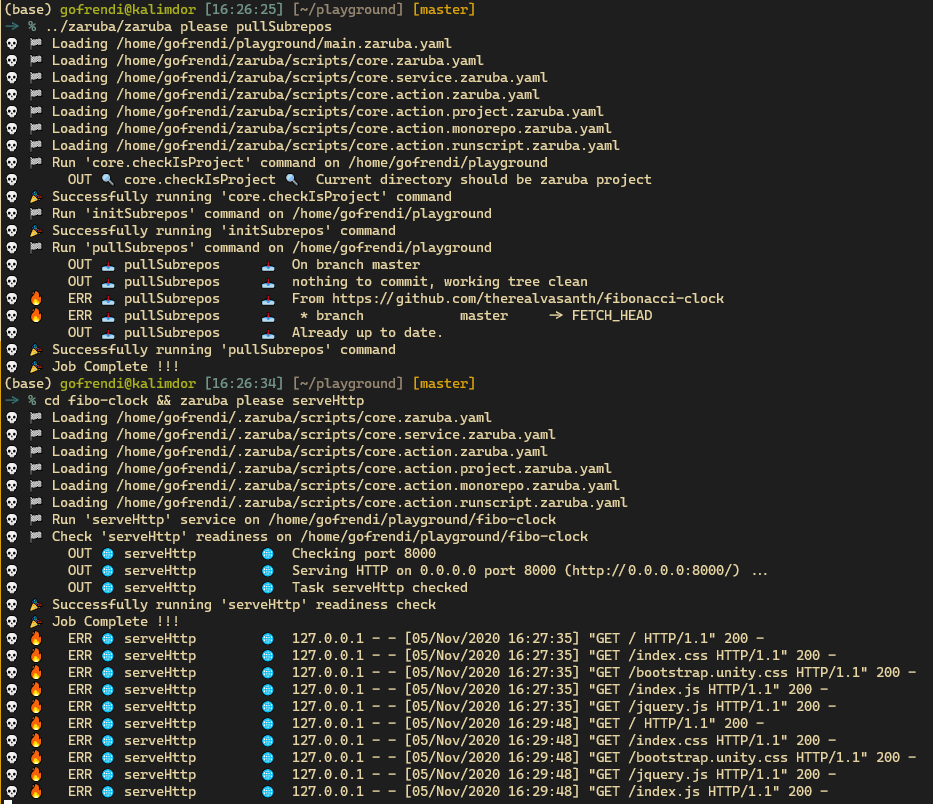
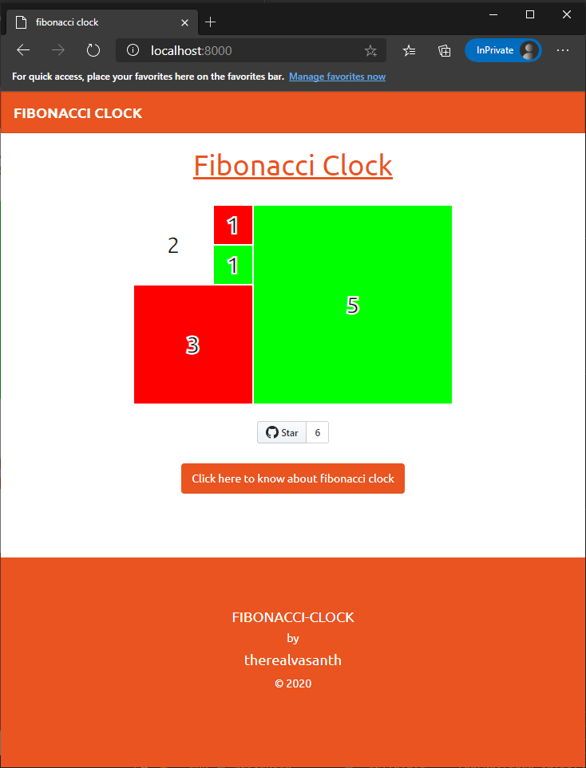

# 💀 Zaruba 

Zaruba is a declarative Task Runner Framework. It helps you to define and orchestrate tasks. In zaruba, a task might extend or depends on each other.

Several tasks are already included and can be extended as necessary. You can even build a full-fledge FastAPI application and having it deployed to your kubernetes cluster by using helm by performing this:

```sh
# Init project
mkdir myProject
cd myProject
zaruba please initProject

# Create FastAPI service, module, and book CRUD
zaruba please makeFastService generator.service.location=myservice
zaruba please makeFastModule generator.service.location=myservice generator.module.name=mymodule
zaruba please makeFastCRUD generator.service.location=myservice generator.module.name=mymodule generator.crud.entity=book generator.crud.fields=title,author,synopsis

# Create task to start zaruba
zaruba please makeServiceTask generator.service.location=myservice generator.service.type=fastapi

# Run service locally
zaruba please run

# Run service (this time containerized)
zaruba please runContainer

# Create helm chart
zaruba please makeHelmCharts

# Create helm deployment for myservice
zaruba please makeServiceDeployment generator.service.location=myservice

# Helm apply
zaruba please helmApply kube.context=docker-desktop
```

> 💡 __TIPS:__ Execute task with `--interactive` flag is probably a good idea if you don't want to remember all the inputs.

# 📜 Zaruba Script

You might already familiar with terraform's HCL, gitlab-ci, or github action. Don't worry if you are not. Those seemingly alien scripts are used to define tasks for automation. Most of those script (except for terraform's HCL) are written in YAML. YAML is like JSON, but it use indentation instead of curly-braces.

Zaruba's script are simply a YAML to define your tasks.

Although you don't need to worry about the script since zaruba can also generate the script for you, it is always better to know what's going on.

Zaruba tasks usually contains 3 keys: `includes`, `inputs` and `tasks`:

```yaml
includes:

- ${ZARUBA_HOME}/scripts/core.zaruba.yaml
- ./zaruba-tasks/runRabbitmq.zaruba.yaml

inputs:

  withApple:
    default: no    
    description: also show apple

tasks:

  run:
    icon: 🚅
    description: Run everything at once
    extend: core.runShellScript
    dependencies:
    - runFibo
    - runRabbitmq
    inputs:
    - withApple
    config:
      start: |
        {{ if eq (.GetValue "withApple") "true" }}
          echo "🍎"
        {{ end }}

  runFibo:
    icon: 📜
    description: Run fibo
    extend: serveHttp
    location: fibo
    env: &fiboEnv
      HTTP_PORT:
        from: FIBO_HTTP_PORT
        default: 8080
    lconfig:
      ports: &fiboPorts
      - '{{ .GetEnv "HTTP_PORT" }}'
    config: {}

```

## includes

This section is pretty straight forward. You can include as many other zaruba script as you need. Several useful scripts are available under `${ZARUBA_HOME}/scripts/core.zaruba.yaml`, so you might want to include it on every zaruba script you create.

## inputs

This section contains possible input for all zaruba tasks. Some tasks might share the same inputs. For example, creating docker container and removing docker container both require `docker.containerName`.

An input might has `default` value and `description`.

## tasks

This section contains task definition. A task might extend or depend on other tasks.

In our example, `runFibo` extend `serveHttp`. It means that `runFibo` is basically `serveHttp` with several configuration overridden.

On the other hand, `run` not only extend `core.runShellScript`, but also depends on `runFibo` and `runRabbitmq`. It means that whenever `run` is executed, `runFibo` and `runRabbitmq` will be executed first.

To execute tasks you can invoke:

```sh
zaruba please <task-names>
# or
zaruba please <task-names> --interactive
```
# 👨‍💻 Installation

## Using docker

Using docker is probably the quickest way to setup zaruba, especially if you need to use zaruba in your CI/CD.

For more information about zaruba's docker image, please visit [dockerhub](https://hub.docker.com/repository/docker/stalchmst/zaruba).

> **⚠️NOTE** There will be some limitations if you run zaruba container by using docker-desktop for mac/windows. Docker-desktop doesn't support host networking, so that you need to expose the ports manually (e.g: `docker run -d --name zaruba -p 8200-8300:8200-8300 -v "$(pwd):/project" stalchmst/zaruba:latest`)

## From source

Installing from source is the best way to setup zaruba for day-to-day use. Currently we don't have any plan to create `apt` or platform-specific packages for zaruba. If you are using windows, you need to install `wsl` in order to get started.

In order to install zaruba from source, you need to have some prerequisites software:

* `go 1.13` or newer (To install `go` quickly you can visit it's [official website](https://golang.org/doc/install))
* `wget` or `curl`
* `git`

> **💡HINT** Ubuntu user (including ubuntu-wsl) can simply invoke `sudo apt-get install golang wget curl git` to install all prerequisites.

After having the prerequisites installed you can then install zaruba by using `curl` or `wget`:

```sh
# Install zaruba by using curl
sh -c "$(curl -fsSL https://raw.githubusercontent.com/state-alchemists/zaruba/master/install.sh)"

# Install zaruba by using wget
sh -c "$(wget -O- https://raw.githubusercontent.com/state-alchemists/zaruba/master/install.sh)"
```

# 🏁 Getting Started

```sh
# setting up
sudo -E zaruba please setupUbuntu
zaruba please setupPyenv

# create project
mkdir myProject
cd myProject
zaruba please initProject

# add external repo
zaruba please addSubrepo subrepo.url="https://github.com/state-alchemists/fibonacci-clock"
zaruba please initSubrepos

cd fibonacci-clock
zaruba please serveHttp
```

While Zaruba shows you what happened in the background:



You can enjoy a pretty fibonacci clock:



# 🔨 Create Custom Task

Zaruba can also do a lot of other tasks. Please type `zaruba please` to see what Zaruba is capable of.

Now, to make things even more interesting, you can define custom tasks. Open up `main.zaruba.yaml` and perform this modification:

```yaml
includes:
  - "${ZARUBA_HOME}/scripts/core.zaruba.yaml"

tasks:

  runFiboClock:
    extend: core.startService
    location: fibonacci-clock
    lconfig:
      ports: [3031]
    config:
      start: "python -m http.server {{ index .LConfig.ports 0 }}"
  
  runNginx:
    extend: core.startDockerContainer
    config:
      containerName: myNginx
      imageName: nginx
      port::3030: 80
  
  runAll:
    dependencies:
      - runFiboClock
      - runNginx
```

By extending `core.startService` and `core.startDockerContainer`, you can run multiple services (either dockerized or not) with a single command.

Try to run

```sh
zaruba please runFiboClock runNginx
# or even better:
zaruba please runAll
```


Perfect !!!

Now you can run micro-services (dockerized or not) in a single computer.

> **💡NOTE** You can add `autostop=true` argument in case of you want zaruba to kill all processes once the task is finished. E.g: `zaruba please testMyApp autostop=true`

# 🐳 Zaruba In Docker

You can use Zaruba docker-container as part of your CI/CD pipeline or as your development machine.

To run Zaruba docker-container you can run:

```sh
docker run --name zaruba -p 2810:8080 -v ${HOME}/your-project-location:/project -d stalchmst/zaruba:latest
```

This will expose Zaruba to port `2810` of your host, as well as mount `${HOME}/your-project-location` as Zaruba's current working directory.

Next time you want to re-run Zaruba's container you can simply perform:

```sh
docker start zaruba
```

# 📁 Documentation

For more comprehensive explanation, please read the [documentation](docs/Documentation.md).

# 🗺️ Roadmap

To see the future of Zaruba, plese visit our [Roadmap](Roadmap.md).

# 🐞 Bug, Feature Request and Contribution

Open [issue](https://github.com/state-alchemists/zaruba/issues) or [pull request](https://github.com/state-alchemists/zaruba/pulls).


# 🎉 Fun Fact

> Madou Ring Zaruba (魔導輪ザルバ, Madōrin Zaruba?) is the Madou Ring for Golden Knight Garo's duties as a Makai Knight. He is a recurring character in the series, acting as a guide for the wearers of the Garo armor and being the narrator of the series in some episodes. [(Garo Wiki | Fandom)](https://garoseries.fandom.com/wiki/Zaruba)
