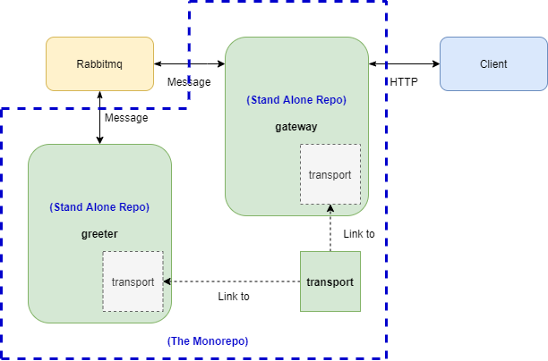
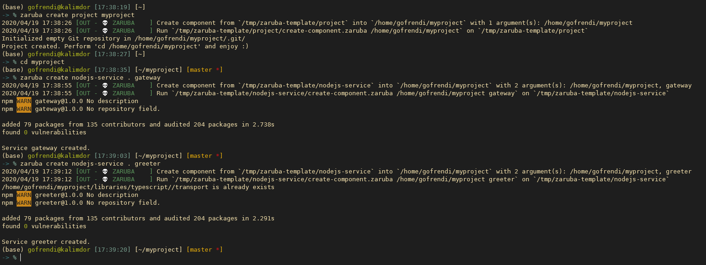
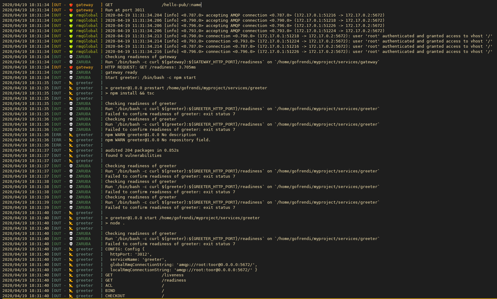
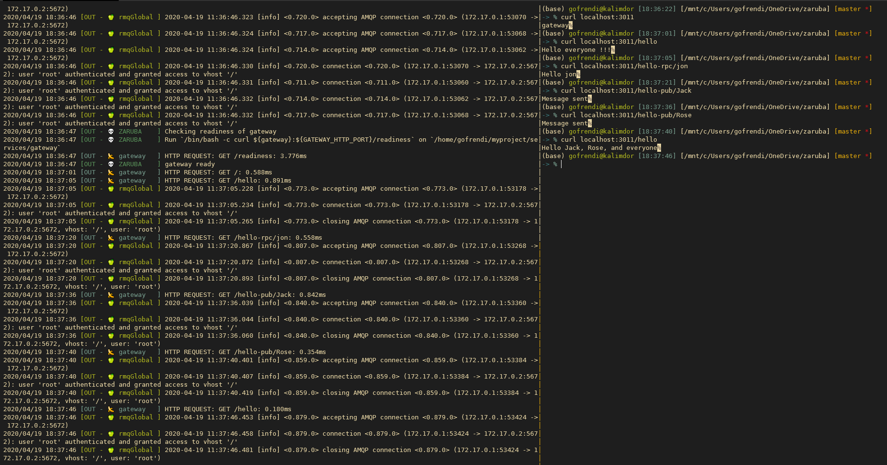

# 💀 Zaruba 

> "My name is Zaruba. I came to be when Garo came to be and I am forever with him."

Zaruba is agnostic generator and service runner. Zaruba treat your project like a big monorepo application containing multiple micro-services. However, zaruba also allows you to publish the micro-services as individual repo, independent from each other.

To see why you probably need monorepo, please look at this [awesome slide](https://www.symfony-news.com/slide/details/a-monorepo-vs-manyrepos).

Despite of the advantages, managing monorepo without a proper tool might brings you a nightmare. Zaruba is specifically created to make monorepo management easier.

# 👨‍💻 Installation

To install zaruba in your local computer, you have to install `golang 1.13`. Next, you can install zaruba by using `curl`:

```bash
sh -c "$(curl -fsSL https://raw.githubusercontent.com/state-alchemists/zaruba/master/install.sh)"
```

or `wget`:

```bash
sh -c "$(wget -O- https://raw.githubusercontent.com/state-alchemists/zaruba/master/install.sh)"
```

If you are using windows, it is recommended to use WSL.

# 🥗 Use Case

Let's say you want to build two services (`greeter` and `gateway`) that talking to each other using Rabbitmq. As both of them need to talk to Rabbitmq in certain way, it is inevitable for them to share a common `transport` library.

Whenever you modify `transport` library, `greeter` and `gateway` should be updated as well.



## Generating Project

Let's start building our project.

```sh
zaruba create project myproject
cd myproject
zaruba create nodejs-service . gateway
zaruba create nodejs-service . greeter
```

After invoking the commands, you should see the following output:



The structure of the generated project is as follow:

```
.
├── README.md
├── libraries
│   ├── README.md
│   └── typescript
│       └── transport            # Our shared library
├── services
│   ├── README.md
│   ├── gateway
│   │   ├── Dockerfile
│   │   ├── Makefile
│   │   ├── README.md
│   │   ├── node_modules
│   │   ├── package-lock.json
│   │   ├── package.json
│   │   ├── src
│   │   ├── tsconfig.json
│   │   └── zaruba.config.yaml   # gateway config
│   └── greeter
│       ├── Dockerfile
│       ├── Makefile
│       ├── README.md
│       ├── node_modules
│       ├── package-lock.json
│       ├── package.json
│       ├── src
│       ├── tsconfig.json
│       └── zaruba.config.yaml   # greeter config
└── zaruba.config.yaml           # project config
```

Now, let's see on top-level `zaruba.config.yaml`. This file contains your project configuration:

```yaml
name: myproject # the name of your project
env:
  GLOBAL_RMQ_CONNECTION_STRING: amqp://root:toor@${rmqGlobal}:5672/ # global environment

components: # list of components
  rmqGlobal: # rabbitmq container definition
    type: container
    image: rabbitmq:3-management
    env:
      RABBITMQ_DEFAULT_USER: root # local environment
      RABBITMQ_DEFAULT_PASS: toor # local environment
    ports:
        5672: 5672   # host: container
        15672: 15672
    readinessCheck: curl ${rmqGlobal}:15672
```

On runtime, zaruba cascade this configuration with service's configuration. Now let's check `services/gateway/zaruba.config.yaml`:

```yaml
env:
  GATEWAY_HTTP_PORT: 3011

components:
  gateway:
    type: service
    origin: "" # fill this one with your git repository
    branch: master
    env:
      LOCAL_RMQ_CONNECTION_STRING: amqp://root:toor@${rmqGlobal}:5672/ # local environment
    location: "."
    start: npm start
    readinessCheck: curl ${gateway}:${GATEWAY_HTTP_PORT}/readiness
    dependencies:
      - rmqGlobal

links:
  ../../libraries/typescript/transport: # shared lib definition
    - ./src/transport
```

Everytime you create a service, zaruba will make the configuration for you. Feel free to modify in case of yo need to so.

## Coding

Let's start with `greeter` first since it need to handle event and RPC call from `gateway`. Modify your `services/greeter/src/components/example/index.ts` into:

```typescript
import { Message } from "../../transport";
import { App } from "../../core";
import { Config } from "../../config";
import { greet, greetEveryone } from "./service";

export class Component {
  private names: string[];
  private app: App;
  private config: Config;

  constructor(app: App, config: Config) {
    this.names = [];
    this.app = app;
    this.config = config;
  }

  setup() {
    const r = this.app.router();
    const rpcServer = this.app.globalRPCServer();
    const subscriber = this.app.globalSubscriber();

    r.all("/", (_, res) => res.send("greeter"));

    // serving RPC Call: helloAll
    rpcServer.registerHandler("helloAll", (...inputs: any[]) => {
      // this will either return "hello everyone !!!" or "hello ${this.names} and everyone" 
      return greetEveryone(this.names);
    });

    // serving RPC Call: helloRPC
    rpcServer.registerHandler("helloRPC", (...inputs: any[]) => {
      if (inputs.length === 0) {
        throw new Error("Message accepted but input is invalid");
      }
      const name = inputs[0] as string
      // thiw will return "hello world !!!" or "hello ${name}"
      return greet(name);
    });

    // subscribe to event: helloEvent
    subscriber.registerHandler("helloEvent", (msg: Message) => {
      const { name } = msg;
      // this will add name to this.names
      this.names.push(name);
    });

  }

}
```

Next, you also need to modify your `services/gateway/src/components/example/index.ts` into:

```typescript
import { App } from "../../core";
import { Config } from "../../config";
import { getName } from "./helpers";

export class Component {
  private app: App;
  private config: Config;

  constructor(app: App, config: Config) {
    this.app = app;
    this.config = config;
  }

  setup() {
    const r = this.app.router();
    const rpcClient = this.app.globalRPCClient();
    const publisher = this.app.globalPublisher();

    r.all("/", (_, res) => res.send("gateway"));

    // Serving HTTP Request: /hello
    r.get("/hello", async (_, res) => {
      try {
        // RPC Call: helloAll
        const greeting = await rpcClient.call("helloAll");
        res.send(greeting);
      } catch (err) {
        res.status(500).send(err);
      }
    });

    // Serving HTTP Request: /hello-rpc/:name
    r.get("/hello-rpc/:name", async (req, res) => {
      const name = getName(req);
      try {
        // RPC Call: helloRPC
        const greeting = await rpcClient.call("helloRPC", name);
        res.send(greeting);
      } catch (err) {
        res.status(500).send(err);
      }
    });

    // Serving HTTP Request: /hello-pub/:name
    r.get("/hello-pub/:name", (req, res) => {
      const name = getName(req);
      try {
        // Publish event: helloEvent
        publisher.publish("helloEvent", { name });
        res.send("Message sent");
      } catch (err) {
        res.status(500).send(err);
      }
    });
  }

}
```

The good thing when you use message broker like rabbit-mq is your services doesn't need to know each other. Just fire a RPC-call or publish an event.

In our case, the RPC-call and event published by `gateway` will be handled by `greeter` since the RPC/Events served by `greeter` are match to `gateway`'s.

## Running Project

Instead of openning a lot of terminals/tmux-panels, zaruba allows you to run your services at once. It is like docker-compose, but without isolation.

To run your project, you just need to invoke:

```sh
zaruba run
```



Now let's check to ensure that everything is working as expected:

```
curl localhost:3011                  # should return `gateway`
curl localhost:3011/hello            # should return `Hello everyone !!!`
curl localhost:3011/hello-rpc/Jon    # should return `Hello Jon`
curl localhost:3011/hello-pub/Jack   # should return `Message sent`
curl localhost:3011/hello-pub/Rose   # should return `Message sent`
curl localhost:3011/hello            # should return `Hello Jack, Rose, and everyone`
```




## Managing Shared Library

Not only helps you to build your project and run your services, zaruba also helps you to manage your shared-libraries.

For example, whenever you change anything `libraries/typescript/transport`, `services/gateway/src/transport` and `services/greeter/src/transport` will also be synchronized once you perform `organize` command:

```sh
zaruba organize
```

To add your own shared libraries, you need to add `links` section to your `zaruba.config.yaml`:

```yaml
links:
  ../../libraries/typescript/transport: # shared lib definition
    - ./src/transport
```

## Go to Multi Repo

It is good to put everything in a single location (aka: monorepo). But in some cases you might also want to publish your services as independent repositories. One good use-case for this is when you want to publish some of your services as open source project, but you want some others to be private.

To enable multi-repo, you need to set your service's `origin`:

```yaml
components:
  gateway:
    type: service
    origin: "git@github.com:myUser/myRepo.git" # fill this one with your git repository

```

Once you set it, you can simply perform:

```sh
zaruba init
zaruba push
```

Now your service is available as independent repository !!!

To reflect changes from multi-repo (in case of there are changes in your service repo), you can perform:

```sh
zaruba pull
```

# ✍🏻 Available Actions

```
Usage:
  zaruba <action> [...args] [flags]
  zaruba [command]

Available Commands:
  create           Create Component
  help             Help about any command
  init             Init a project
  install-template Install template
  organize         Organize a project
  pull             Pull from subtrees
  push             Push from subtrees
  run              Run project
  version          Print the version number of Zaruba

Flags:
  -h, --help   help for zaruba

Use "zaruba [command] --help" for more information about a command.
```

# 👴 Concepts

## Template

Templates are component's blueprint. It can be a node.js package, python program, or even bunch of shell scripts.

A template should contains at least two files:

* `install-template.zaruba`: Any executable script, containing set of commands to be executed after user install the template. You might find some `npm init` or `pip install` here.
* `create-component.zaruba`: Any executable script, containing set of commands to be executed when user creates new component based on current template. `create-component` should at least a single argument containing project directory.

To install a template, you can perform:

```sh
zaruba install-template https://github.com/someUser/someTemplate.git
```

## Project

Project is a directory containing set of components. A project might also be a component on it's own.

## Component

Component can be anything from a project, a shared library, or a single service.

A component is usually based on specific template, but user can also create their own components from scratch. Also, a component should contains at least a single file:

* `link`: Any executable script, containing set of commands to be executed when user perform `zaruba organize` or `zaruba watch`.

Optionally, a component can also has `organize-project.zaruba` or any other shell script for custom command.

To create a new component, you can perform:

```sh
zaruba create someTemplate
```

# Commmands

## install-template

```sh
zaruba install-template <template-git-url> [folder-name]
```

This one basically run `git clone <template-gir-url>` and executing `install-template`.

While running `install-template`, current working directory is set to `[folder-name]`. However, if `[folder-name]` is not specified, zaruba will use `<template-git-url>`'s repository name as `[folder-name]`.

## create

```sh
zaruba create <template> [project-dir [...args]]
```

This will run template's `create <project-dir> [...args]`. Typically, it should create new component based on `<template>`. It is assumed that current working directory is pointing to `<template>`.

## organize

```sh
zaruba organize [project-dir [...args]]
```

This command will do the following actions:

* Copy sources to their respective destinations.
* Recursively look for and run `organize-project.zaruba` in every sub-directory of `<project-dir>` and execute it. This command support pre-action (`pre-organize-project.zaruba`) and post-action (`post-organize-project.zaruba`).

# 👩🏻‍🏫 Configuration

## Environment Variable

* `ZARUBA_TEMPLATE_DIR`: Zaruba's template directory, default to `<zaruba-parent-dir>/templates`
* `ZARUBA_SHELL`: Default to `/bin/bash`
* `ZARUBA_SHELL_ARG`: Default to `-c`

# 🙇🏽 Testing

Copy `template.env` to `.env` and invoke:

```sh
source .env
make test # or make test-verbose
```

# Clone (Only for State-alchemists crews)

```
git clone git@github.com:state-alchemists/zaruba.git
cd zaruba
make install
zaruba init
zaruba pull
```