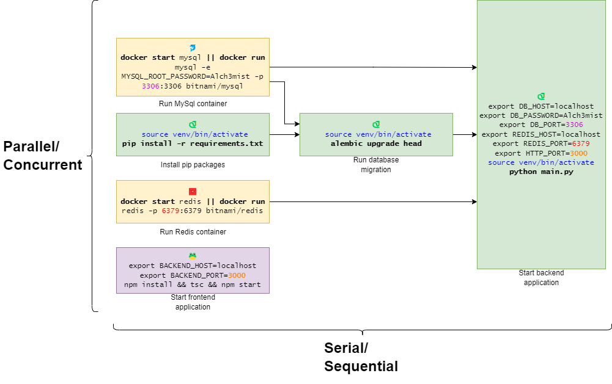
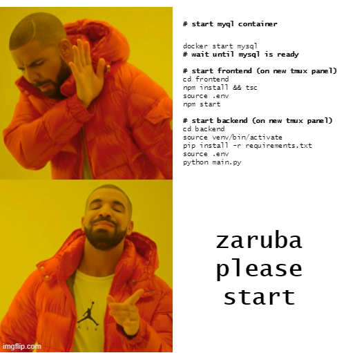

> ⚠️ __This repository is archived.__ Please see [__new Zrb repository__](https://github.com/state-alchemists/zrb). The new repository is re-written in Python and no longer uses YAML as configuration.


[Documentation](docs/README.md) | [Tutorial](docs/use-cases/from-zero-to-cloud.md) | [Installation](#-installation)


# 🤖 Zaruba 

Zaruba is a [task](docs/core-concepts/task/README.md) runner and [CLI utility](docs/utilities/README.md). It helps you __prepare__, __run__, __deploy__, and __debug__ your applications.

We believe, a good tool not only increases productivity but also changes and transforms people. In turn, a good tool will enable people to achieve their goals and open many other opportunities.

## ❓ Problem

Developing/debugging a system can be challenging. 

Your system might consist of __several applications that depend on each other__. And you need to __watch every message or error logged__ by your applications. So, you might end up opening many Tmux panels.

Let's say you have a system with the following components:
- A __frontend__ application
- A __backend__ application
- __MySQL__
- __Redis__

You will need to run a lot of commands whenever you want to run your system for debugging/development purposes.

Let's take a look at the following diagram:



You can quickly notice that:

- ⛓️ You can run `Install Node Packages`, `Start MySql Container`, `Install Pip Packages`, and `Start Redis Container` __in parallel__.
- 🔗 Some tasks __depend__ on other tasks. For example:
  - To `Start Database Migration`, you must make sure that:
    - MySql Container is already running.
    - Necessary Pip packages have been installed.
  - To `Start Backend Application`, you must make sure that:
    - Redis Container is already running.
    - MySql Container is already running.
    - Database migration has been performed.
  - To `Start Frontend Application`, you must make sure that the Frontend Application has been built properly.
- 📐 Some tasks __share similar behavior__. For example, to start Redis/MySQL Container, you need to run the same command with a different set of parameters.
- ⚙️ Several tasks might __share a similar configuration__. For example:
  - `BACKEND_PORT` in your Frontend should reflect `HTTP_PORT` in your Backend.
  - `DB_PASSWORD` in your backend has to reflect `MYSQL_ROOT_PASSWORD` in your MySQL container.

There are a lot of things you need to consider, just to run your system on your local computer.

Zaruba takes the burden from you by providing a nice task definition for your project. Thus, you will only need to run a short nice command to run everything at once:

```bash
zaruba please start
```

## 💡 Solution

Instead of opening many [Tmux](https://en.wikipedia.org/wiki/Tmux) panels, Zaruba allows you to define and run __a single task to run everything at once__.



In Zaruba, you can think of [tasks](docs/core-concepts/task/README.md) as [DAG](https://en.wikipedia.org/wiki/Directed_acyclic_graph). __A task can have many [dependencies](docs/core-concepts/task/define-task-dependencies.md)__. And Zaruba will always run the dependencies first before running your tasks.

Zaruba also lets you __link [task environments](docs/core-concepts/task/task-envs/README.md) to system environments__. This allows you to configure your applications as a single system.

Let's revisit the problem we discuss in the previous section.

First, you can make a task definition like the following:

<details>
<summary>
🔍 Expand to see the task definition.
</summary>

```yaml
tasks:

  start:
    dependencies:
      - startFrontend
      - startBackend
  
  # 🐸 Frontend tasks
  startFrontend:
    location: ./frontend
    extend: zrbStartApp
    configs:
      start: npm start
      ports: 8080
    envs:
      BACKEND_PORT:
        from: BACKEND_PORT
    dependencies:
      - buildFrontend

  buildFrontend:
    location: ./frontend
    extend: zrbRunShellScript
    configs:
      start: tsc
    dependencies:
      - installNpmFrontend

  installNpmFrontend:
    location: ./frontend
    extend: zrbRunShellScript
    configs:
      start: npm install

  # 🐍 Backend tasks
  startBackend:
    location: ./backend
    extend: zrbStartApp
    configs:
      ports: ${APP_HTTP_PORT}
      start: |
        source venv/bin/activate
        python main.py
    envs:
      APP_DB_USER:
        from: DB_USER
      APP_DB_PASSWORD:
        from: DB_PASSWORD
      APP_DB_PORT:
        from: DB_PORT
      APP_HTTP_PORT:
        from: BACKEND_PORT
    dependencies:
      - migrateBackend
      - startMysql
      - startRedis

  migrateBackend:
    location: ./backend
    extend: zrbRunShellScript
    configs:
      start: |
        source venv/bin/activate
        alembic upgrade head
    envs:
      APP_DB_USER:
        from: DB_USER
      APP_DB_PASSWORD:
        from: DB_PASSWORD
      APP_DB_PORT:
        from: DB_PORT
    dependencies:
      - installPipBackend
      - startMysql

  installPipBackend:
    location: ./backend
    extend: zrbRunShellScript
    configs:
      start: |
        source venv/bin/activate
        pip install -r requirements.txt
    envs:
      APP_DB_USER:
        from: DB_USER
      APP_DB_PASSWORD:
        from: DB_PASSWORD
      APP_DB_PORT:
        from: DB_PORT

  # 🐬 Mysql tasks
  startMysql:
    extend: zrbStartDockerContainer
    envs:
      MYSQL_ROOT_PASSWORD:
        from: DB_PASSWORD
    configs:
      imageName: mysql
      port: 3306

  # 🟥 Redis tasks
  startRedis:
    extend: zrbStartDockerContainer
    configs:
      imageName: redis
      port: 6379
      
```
</details>

> 💡🤖 Don't be intimidated by the script, You can asks Zaruba to create the scripts automatically.


Aside from the dependencies, you can also see that some of your tasks share the same environment value, for example `startBackend.envs.DB_PASSWORD` and `startMysql.envs.MYSQL_ROOT_PASSWORD` are refering to the same global environment, `DB_PASSWORD`.

To define the environment, you need to create `.env` file as follow:

```
DB_HOST=localhost
DB_USER=root
DB_PASSWORD=toor
BACKEND_HOST=localhost
BACKEND_PORT=3000
```

Then you can invoke the following commands:

```bash
# start everything
zaruba please start
# start frontend only
zaruba please startFrontend
# start redis and mysql
zaruba please startMysql startRedis
```


# 🔍 Tutorial

You can visit the [end-to-end tutorials](docs/use-cases/from-zero-to-cloud.md) to see:

- How to make a working [microservices-ready monolith](https://github.com/state-alchemists/amalgam/blob/master/myProject/myApp/_docs/motivation-and-architecture/README.md).
- How to create CRUD features and web pages
- How to run everything on your 🖥️ local computer (as monolith or microservices).
- How to run everything on your local computer as 🐳 containers (as monolith or microservices).
- How to deploy everything on your ☸️ Kubernetes cluster.

# 💡 Similar Projects/Solutions

Zaruba is focusing on helping you to write/generate/run your applications. Some of those goals are overlapped with other tools. Zaruba __is not a replacement__ for those tools.

- [Shell script](https://www.shellscript.sh/): Shell script can help you to run multiple tasks sequentially. You can also use background processes to execute many tasks at once. Shell script supports control logic like branch and loop. You can think of Zaruba as a declarative framework to manage your shell scripts.
- [Tmux](https://github.com/tmux/tmux): Tmux allows you to open multiple terminals at once. Thus it also supports parallelism. Unlike tmux, Zaruba runs your processes at a single panel.
- [Screen](https://www.gnu.org/software/screen/): Screen is similar to tmux in so many ways.
- [Docker Compose](https://docs.docker.com/compose/): Docker Compose supports parallelism. If you can define your tasks as Docker containers, Docker Compose is a good alternative to Zaruba. But, unlike Docker Compose, Zaruba also supports local processes.
- [Ansible](https://www.ansible.com/): Ansible is an automation platform. Ansible focuses on managing your servers, while Zaruba focuses on helping you to run/debug your applications. With Zaruba, you can choose to use DBMS/messaging system in the cloud or locally. Some Zaruba tasks have `runInLocal` config that you can manage easily.
- [Telemetry](https://www.telepresence.io/): If you deployed your application in the Kubernetes cluster, telemetry is a good alternative to Zaruba. Telemetry allows you to run some of your services locally. This is very useful for debugging, similar to `runInLocal` config on Zaruba. Unlike telemetry, Zaruba is also able to help you generate deployment/deploy your application.

# 👨‍💻 Installation

<details>
<summary><bold>TL;DR</bold></summary>

```bash
sudo apt-get install golang wget curl git
sh -c "$(curl -fsSL https://raw.githubusercontent.com/state-alchemists/zaruba/master/install.sh)"
zaruba install ubuntu-essentials
zaruba install docker
zaruba install kubectl
zaruba install helm
zaruba install pulumi
```

Visit the [getting started section](#-getting-started).

</details>

## 📖 From Source

Installing from source is the best way to set up Zaruba for day-to-day use.

We don't plan to create [APT](https://en.wikipedia.org/wiki/APT_(software)) or platform-specific packages for Zaruba. If you are using windows, you need to install [WSL](https://docs.microsoft.com/en-us/windows/wsl/install) to get started.

### 🧅 Prerequisites

Before installing Zaruba from the source, you need to install some prerequisites:

* `go 1.16` or newer (To install `go`, you can visit its [official website](https://golang.org/doc/install))
* `wget` or `curl`
* `git`

> __💡 HINT__ If you are using Ubuntu, you can install all prerequisites by invoking: `sudo apt-get install golang wget curl git`.

### 🥗 Installing From Source

To install Zaruba using __curl__, you can do the following:

```bash
sh -c "$(curl -fsSL https://raw.githubusercontent.com/state-alchemists/zaruba/master/install.sh)"
```

To install Zaruba using __wget__, you can do the following:

 ```bash
sh -c "$(wget -O- https://raw.githubusercontent.com/state-alchemists/zaruba/master/install.sh)"
```

## 🐳 Using Docker

Using docker is the quickest way to install Zaruba, especially if you need to use Zaruba in your CI/CD.

To create and run a Zaruba container on a __🐧Linux__ host, you can do the following:

```bash
docker run -d --name zaruba --network host \
  -v "$(pwd):/project" \
  -e "ZARUBA_HOST_DOCKER_INTERNAL=172.17.0.1" \
  -e "DOCKER_HOST=tcp://172.17.0.1:2375" \
  stalchmst/zaruba:latest
```

To create and run a Zaruba container on a __🪟 Windows__/__🍎 Mac__ host, you can do the following:

```bash
docker run -d --name zaruba \
  -p 8500-8700:8500-8700 \
  -v "$(pwd):/project" \
  stalchmst/zaruba:latest
```

For more information about Zaruba's docker image, please visit [docker hub](https://hub.docker.com/repository/docker/stalchmst/zaruba).

> __⚠️ NOTE__ There will be some limitations if you run Zaruba container in `docker-desktop`. For example, docker-desktop doesn't support host networking. Thus, you need to expose the ports by yourself. (e.g., `docker run -d --name zaruba -p 8200-8300:8200-8300 -v "$(pwd):/project" stalchmst/zaruba:latest`)

# 📜 Getting Started

To get started, you can:

* [📖 Browse the documentation](docs/README.md),
* [❇️ Follow end to end tutorials](docs/use-cases/from-zero-to-cloud.md), and
* [🧠 Learn the core concept](docs/core-concepts/README.md)

# ➕ Extra Prerequisites

Some tasks need `docker`, `kubectl`, `helm`, and `pulumi` installed. You can invoke the following command to install those extra prerequisites: 

```bash
zaruba install <extra-prerequisite>
```

To see whether you need to install extra prerequisites or not, you can use this guide:

* You need [docker](https://www.docker.com/get-started) to build, pull or push images. You also need docker if you want to run your applications as containers.
* You need [kubectl](https://kubernetes.io/docs/home/#learn-how-to-use-kubernetes) to access your Kubernetes cluster.
* You need [helm](https://helm.sh/) and [pulumi](https://www.pulumi.com/) to deploy your applications into a Kubernetes cluster.
* You need [tocer](https://github.com/state-alchemists/tocer) to scaffold Zaruba's documentation.
* You need [pyenv](https://github.com/pyenv/pyenv) to run many `Python` versions.
* You need [nvm](https://github.com/nvm-sh/nvm) to run many `Node.Js` versions.

To install all extra prerequisites, please perform:

```bash
zaruba install docker
zaruba install kubectl
zaruba install helm
zaruba install pulumi
zaruba install pyenv
zaruba install nvm
```

# 🐞 Bug Report, Feature Request, and Contribution

You can always open an [issue](https://github.com/state-alchemists/zaruba/issues) or a [pull request](https://github.com/state-alchemists/zaruba/pulls).

When opening a pull request, please write down:

* Zaruba version you used.
* Your expectation/goal.
* Things you have tried to achieve the goal.
* The result you get.

> __💡 HINT__ You can get the zaruba version invoking: `zaruba version`.

# ☑️ Testing

To perform the test, you need to have:

* docker desktop
* kubectl
* helm
* pulumi
* go 1.16
* make

Once you meet all the prerequisites, you can perform:

```bash
make test
```

# ☕ Donation

Help Red Skull to click the donation button:

[](https://stalchmst.com/donation)

# 🎉 Fun fact

> Madou Ring Zaruba (魔導輪ザルバ, Madōrin Zaruba) is a Madougu which supports bearers of the Garo Armor. [(Garo Wiki | Fandom)](https://garoseries.fandom.com/wiki/Zaruba)


