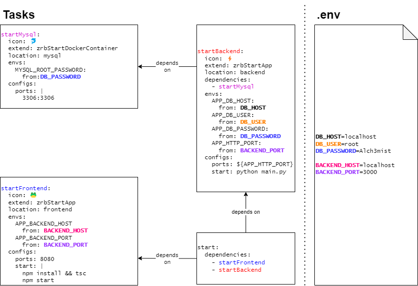

[⬅️ README](../README.md)

# 🏠 Zaruba Documentation

Welcome to Zaruba Documentation.

Zaruba is a [task](core-concepts/task/README.md) runner and [CLI utility](utilities/README.md). It helps you __prepare__, __run__, __deploy__, and __debug__ your applications.

To start working with Zaruba, you need to [create a project](use-cases/create-a-project.md) and [add some resources](use-cases/add-resources/README.md). Once your project is ready, you can start [running some tasks](run-tasks/README.md). 

In Zaruba, you can define your tasks as YAML.

You can [visit the core concepts](core-concepts/README.md) to know more about the detail.

Finally, you can visit our [end-to-end tutorial](use-cases/from-zero-to-cloud.md) to get a better glimpse.

# Table of Content

<!--startToc-->
- [⚙️ Zaruba Configuration](zarubaConfiguration.md)
- [🏃 Run task](runTask/README.md)
  - [🍺 Run a Single Task](runTask/runASingleTask.md)
  - [🍻 Run Many Tasks in Parallel](runTask/runManyTasksInParallel.md)
  - [🏝️ Run Task with Custom Environments](runTask/runTaskWithCustomEnvironments.md)
  - [🔤 Run task with custom values](runTask/runTaskWithCustomValues.md)
  - [🏓 Run task interactively](runTask/runTaskInteractively.md)
- [🔎 Explain task](explainTask.md)
- [🧠 Core Concepts](coreConcepts/README.md)
  - [🏗️ Project](coreConcepts/project/README.md)
    - [🧬 Project Anatomy](coreConcepts/project/projectAnatomy.md)
    - [🧳 Includes](coreConcepts/project/includes.md)
    - [🔤 Project Inputs](coreConcepts/project/projectInputs.md)
    - [⚙️ Project Configs](coreConcepts/project/projectConfigs.md)
    - [🏝️ Project Envs](coreConcepts/project/projectEnvs.md)
  - [🔨 Task](coreConcepts/task/README.md)
    - [🧬 Task Anatomy](coreConcepts/task/taskAnatomy.md)
    - [🥛 Simple Command](coreConcepts/task/simpleCommand.md)
    - [🍹 Long Running Service](coreConcepts/task/longRunningService.md)
    - [⚙️ Task Configs](coreConcepts/task/taskConfigs/README.md)
      - [Shared Configs](coreConcepts/task/taskConfigs/sharedConfigs.md)
    - [🏝️ Task Envs](coreConcepts/task/taskEnvs/README.md)
      - [Shared Envs](coreConcepts/task/taskEnvs/sharedEnvs.md)
    - [🔤 Task Inputs](coreConcepts/task/taskInputs.md)
    - [🧒 Extend task](coreConcepts/task/extendTask.md)
    - [🍲 Define task dependencies](coreConcepts/task/defineTaskDependencies.md)
  - [🐹 Use Go Template](coreConcepts/useGoTemplate.md)
- [👷🏽 Use Cases](useCases/README.md)
  - [❇️ From Zero to Cloud](useCases/fromZeroToCloud.md)
  - [🏗️ Create a Project](useCases/createAProject.md)
  - [📦 Add Resources](useCases/addResources/README.md)
    - [🧩 Integration](useCases/addResources/integration/README.md)
      - [📦 External Repository](useCases/addResources/integration/externalRepository.md)
      - [🐳 Docker Container](useCases/addResources/integration/dockerContainer.md)
      - [🐳 Docker Compose](useCases/addResources/integration/dockerCompose.md)
      - [☸️ Helm Chart](useCases/addResources/integration/helmChart.md)
    - [✨ From Scratch](useCases/addResources/fromScratch/README.md)
      - [🏃 Add Runner for Existing Application](useCases/addResources/fromScratch/addRunnerForExistingApplication/README.md)
        - [Go Application Runner](useCases/addResources/fromScratch/addRunnerForExistingApplication/goApplicationRunner.md)
        - [NodeJs Application Runner](useCases/addResources/fromScratch/addRunnerForExistingApplication/nodeJsApplicationRunner.md)
        - [Python Application Runner](useCases/addResources/fromScratch/addRunnerForExistingApplication/pythonApplicationRunner.md)
      - [✨ Generate New Application](useCases/addResources/fromScratch/generateNewApplication/README.md)
        - [Simple Go Application](useCases/addResources/fromScratch/generateNewApplication/simpleGoApplication.md)
        - [Simple NodeJs Application](useCases/addResources/fromScratch/generateNewApplication/simpleNodeJsApplication.md)
        - [Simple Python Application](useCases/addResources/fromScratch/generateNewApplication/simplePythonApplication.md)
        - [Simple TypeScript Application](useCases/addResources/fromScratch/generateNewApplication/simpleTypeScriptApplication.md)
        - [FastApi Application](useCases/addResources/fromScratch/generateNewApplication/fastApiApplication/README.md)
          - [Route](useCases/addResources/fromScratch/generateNewApplication/fastApiApplication/route.md)
          - [Event Handler](useCases/addResources/fromScratch/generateNewApplication/fastApiApplication/eventHandler.md)
          - [Rpc Handler](useCases/addResources/fromScratch/generateNewApplication/fastApiApplication/rpcHandler.md)
          - [Crud](useCases/addResources/fromScratch/generateNewApplication/fastApiApplication/crud.md)
      - [🚢 Add Application Deployment](useCases/addResources/fromScratch/addApplicationDeployment.md)
      - [🥉 Add Third Party Service](useCases/addResources/fromScratch/addThirdPartyService.md)
    - [⚙️ Resource Configurations](useCases/addResources/resourceConfigurations.md)
  - [🏭 Add Generator](useCases/addGenerator.md)
  - [🏝️ Synchronize task environments](useCases/synchronizeTaskEnvironments.md)
  - [🚌 Run Applications Locally](useCases/runApplicationsLocally.md)
  - [🏃‍♂️ Run Some Applications Locally](useCases/runSomeApplicationsLocally.md)
  - [🚀 Deploy Applications](useCases/deployApplications.md)
- [🔧 Utilities](utilities/README.md)
  - [Base64](utilities/base64/README.md)
    - [Decode](utilities/base64/decode.md)
    - [Encode](utilities/base64/encode.md)
  - [🏝️ Env](utilities/env/README.md)
    - [Get](utilities/env/get.md)
    - [Print](utilities/env/print.md)
    - [Read](utilities/env/read.md)
  - [🧩 Install](utilities/install.md)
  - [📁 File](utilities/file/README.md)
    - [Copy](utilities/file/copy.md)
    - [GetLine](utilities/file/getLine.md)
    - [GetLineIndex](utilities/file/getLineIndex.md)
    - [InsertBefore](utilities/file/insertBefore.md)
    - [InsertAfter](utilities/file/insertAfter.md)
    - [List](utilities/file/list.md)
    - [Read](utilities/file/read.md)
    - [Replace](utilities/file/replace.md)
    - [Submatch](utilities/file/submatch.md)
    - [Walk](utilities/file/walk.md)
  - [🚈 Lines](utilities/lines/README.md)
    - [GetIndex](utilities/lines/getIndex.md)
    - [InsertAfter](utilities/lines/insertAfter.md)
    - [InsertBefore](utilities/lines/insertBefore.md)
    - [Read](utilities/lines/read.md)
    - [Replace](utilities/lines/replace.md)
    - [Submatch](utilities/lines/submatch.md)
    - [Write](utilities/lines/write.md)
  - [🧺 List](utilities/list/README.md)
    - [Append](utilities/list/append.md)
    - [Contain](utilities/list/contain.md)
    - [Get](utilities/list/get.md)
    - [Join](utilities/list/join.md)
    - [Length](utilities/list/length.md)
    - [Merge](utilities/list/merge.md)
    - [RangeIndex](utilities/list/rangeIndex.md)
    - [Set](utilities/list/set.md)
    - [Validate](utilities/list/validate.md)
  - [🗺️ Map](utilities/map/README.md)
    - [Get](utilities/map/get.md)
    - [GetKeys](utilities/map/getKeys.md)
    - [Merge](utilities/map/merge.md)
    - [RangeKey](utilities/map/rangeKey.md)
    - [Set](utilities/map/set.md)
    - [ToStringMap](utilities/map/toStringMap.md)
    - [ToVariedStringMap](utilities/map/toVariedStringMap.md)
    - [TransformKey](utilities/map/transformKey.md)
    - [Validate](utilities/map/validate.md)
  - [🔢 Num](utilities/num/README.md)
    - [Add](utilities/num/add.md)
    - [Divide](utilities/num/divide.md)
    - [Multiply](utilities/num/multiply.md)
    - [Range](utilities/num/range.md)
    - [Subtract](utilities/num/subtract.md)
    - [ValidateFloat](utilities/num/validateFloat.md)
    - [ValidateInt](utilities/num/validateInt.md)
  - [🛣️ Path](utilities/path/README.md)
    - [GetAppName](utilities/path/getAppName.md)
    - [GetEnv](utilities/path/getEnv.md)
    - [GetPortConfig](utilities/path/getPortConfig.md)
    - [GetRelativePath](utilities/path/getRelativePath.md)
  - [🏗️ Project](utilities/project/README.md)
    - [AddTask](utilities/project/addTask.md)
    - [Include](utilities/project/include.md)
    - [SetValue](utilities/project/setValue.md)
    - [ShowLog](utilities/project/showLog.md)
    - [SyncEnv](utilities/project/syncEnv.md)
    - [SyncEnvFiles](utilities/project/syncEnvFiles.md)
  - [🔠 Str](utilities/str/README.md)
    - [AddPrefix](utilities/str/addPrefix.md)
    - [CurrentTime](utilities/str/currentTime.md)
    - [DecodeBase64](utilities/str/decodeBase64.md)
    - [DoubleQuote](utilities/str/doubleQuote.md)
    - [EncodeBase64](utilities/str/encodeBase64.md)
    - [FullIndent](utilities/str/fullIndent.md)
    - [GetIndentation](utilities/str/getIndentation.md)
    - [Indent](utilities/str/indent.md)
    - [NewName](utilities/str/newName.md)
    - [NewUuid](utilities/str/newUuid.md)
    - [PadLeft](utilities/str/padLeft.md)
    - [PadRight](utilities/str/padRight.md)
    - [Repeat](utilities/str/repeat.md)
    - [Replace](utilities/str/replace.md)
    - [SingleQuote](utilities/str/singleQuote.md)
    - [Split](utilities/str/split.md)
    - [Submatch](utilities/str/submatch.md)
    - [ToCamel](utilities/str/toCamel.md)
    - [ToKebab](utilities/str/toKebab.md)
    - [ToLower](utilities/str/toLower.md)
    - [ToPascal](utilities/str/toPascal.md)
    - [ToPlural](utilities/str/toPlural.md)
    - [ToSingular](utilities/str/toSingular.md)
    - [ToSnake](utilities/str/toSnake.md)
    - [ToUpper](utilities/str/toUpper.md)
    - [ToUpperSnake](utilities/str/toUpperSnake.md)
  - [🔨 Task](utilities/task/README.md)
    - [AddDependencies](utilities/task/addDependencies.md)
    - [AddParents](utilities/task/addParents.md)
    - [GetIcon](utilities/task/getIcon.md)
    - [IsExist](utilities/task/isExist.md)
    - [SetConfig](utilities/task/setConfig.md)
    - [SetEnv](utilities/task/setEnv.md)
    - [SyncEnv](utilities/task/syncEnv.md)
  - [🍠 Yaml](utilities/yaml/README.md)
    - [Print](utilities/yaml/print.md)
    - [Read](utilities/yaml/read.md)
  - [🍠 Json](utilities/json/README.md)
    - [Print](utilities/json/print.md)
- [🥝 Core Tasks](coreTasks/README.md)
  - [🪂 addAirbyte](coreTasks/addAirbyte.md)
  - [🎐 addAirflow](coreTasks/addAirflow.md)
  - [🚢 addAppHelmDeployment](coreTasks/addAppHelmDeployment.md)
  - [🐶 addAppRunner](coreTasks/addAppRunner.md)
  - [👀 addCassandra](coreTasks/addCassandra.md)
  - [🟨 addClickhouse](coreTasks/addClickhouse.md)
  - [🧰 addContainerRegistry](coreTasks/addContainerRegistry.md)
  - [🐳 addDockerAppRunner](coreTasks/addDockerAppRunner.md)
  - [🐳 addDockerComposeAppRunner](coreTasks/addDockerComposeAppRunner.md)
  - [📙 addEc2Deployment](coreTasks/addEc2Deployment.md)
  - [📙 addEksDeployment](coreTasks/addEksDeployment.md)
  - [🍜 addElasticsearch](coreTasks/addElasticsearch.md)
  - [⚛️ addFastApp](coreTasks/addFastApp.md)
  - [⚛️ addFastAppCrud](coreTasks/addFastAppCrud.md)
  - [⚛️ addFastAppCrudField](coreTasks/addFastAppCrudField.md)
  - [⚛️ addFastAppEventHandler](coreTasks/addFastAppEventHandler.md)
  - [⚛️ addFastAppModule](coreTasks/addFastAppModule.md)
  - [⚛️ addFastAppPage](coreTasks/addFastAppPage.md)
  - [⚛️ addFastAppRouteHandler](coreTasks/addFastAppRouteHandler.md)
  - [⚛️ addFastAppRpcHandler](coreTasks/addFastAppRpcHandler.md)
  - [🪄 addGenerator](coreTasks/addGenerator.md)
  - [🦊 addGitlab](coreTasks/addGitlab.md)
  - [🐹 addGoAppRunner](coreTasks/addGoAppRunner.md)
  - [🧪 addJupyterNotebook](coreTasks/addJupyterNotebook.md)
  - [🚌 addKafka](coreTasks/addKafka.md)
  - [🧪 addMaterialize](coreTasks/addMaterialize.md)
  - [🐉 addMeltano](coreTasks/addMeltano.md)
  - [Ⓜ️ addMetabase](coreTasks/addMetabase.md)
  - [🧪 addMinio](coreTasks/addMinio.md)
  - [🍃 addMongodb](coreTasks/addMongodb.md)
  - [🐬 addMysql](coreTasks/addMysql.md)
  - [🚢 addMysqlHelmDeployment](coreTasks/addMysqlHelmDeployment.md)
  - [📗 addNginx](coreTasks/addNginx.md)
  - [🐸 addNodeJsAppRunner](coreTasks/addNodeJsAppRunner.md)
  - [🐘 addPostgresql](coreTasks/addPostgresql.md)
  - [💯 addPrefect](coreTasks/addPrefect.md)
  - [🔗 addProjectLink](coreTasks/addProjectLink.md)
  - [🐍 addPythonAppRunner](coreTasks/addPythonAppRunner.md)
  - [🐇 addRabbitmq](coreTasks/addRabbitmq.md)
  - [🚢 addRabbitmqHelmDeployment](coreTasks/addRabbitmqHelmDeployment.md)
  - [🧰 addRedis](coreTasks/addRedis.md)
  - [🐳 addSimpleDockerApp](coreTasks/addSimpleDockerApp.md)
  - [🐳 addSimpleDockerComposeApp](coreTasks/addSimpleDockerComposeApp.md)
  - [🐹 addSimpleGoApp](coreTasks/addSimpleGoApp.md)
  - [🐸 addSimpleNodeJsApp](coreTasks/addSimpleNodeJsApp.md)
  - [🐍 addSimplePythonApp](coreTasks/addSimplePythonApp.md)
  - [🐸 addSimpleTypeScriptApp](coreTasks/addSimpleTypeScriptApp.md)
  - [🧪 addSonarqube](coreTasks/addSonarqube.md)
  - [💥 addSpark](coreTasks/addSpark.md)
  - [🥂 addSubrepo](coreTasks/addSubrepo.md)
  - [🐰 addTrino](coreTasks/addTrino.md)
  - [🚧 initProject](coreTasks/initProject.md)
  - [📦 initSubrepos](coreTasks/initSubrepos.md)
  - [🪂 makeAirbyteApp](coreTasks/makeAirbyteApp.md)
  - [🪂 makeAirbyteAppRunner](coreTasks/makeAirbyteAppRunner.md)
  - [🎐 makeAirflowApp](coreTasks/makeAirflowApp.md)
  - [🎐 makeAirflowAppRunner](coreTasks/makeAirflowAppRunner.md)
  - [📜 makeApp](coreTasks/makeApp.md)
  - [🚢 makeAppHelmDeployment](coreTasks/makeAppHelmDeployment.md)
  - [🚢 makeAppHelmDeploymentTask](coreTasks/makeAppHelmDeploymentTask.md)
  - [🐶 makeAppRunner](coreTasks/makeAppRunner.md)
  - [👀 makeCassandraApp](coreTasks/makeCassandraApp.md)
  - [👀 makeCassandraAppRunner](coreTasks/makeCassandraAppRunner.md)
  - [🟨 makeClickhouseApp](coreTasks/makeClickhouseApp.md)
  - [🟨 makeClickhouseAppRunner](coreTasks/makeClickhouseAppRunner.md)
  - [🧰 makeContainerRegistryApp](coreTasks/makeContainerRegistryApp.md)
  - [🗃️ makeContainerRegistryAppRunner](coreTasks/makeContainerRegistryAppRunner.md)
  - [🐳 makeDockerComposeApp](coreTasks/makeDockerComposeApp.md)
  - [🐳 makeDockerComposeAppRunner](coreTasks/makeDockerComposeAppRunner.md)
  - [🐳 makeDockerContainerApp](coreTasks/makeDockerContainerApp.md)
  - [🐳 makeDockerContainerAppRunner](coreTasks/makeDockerContainerAppRunner.md)
  - [📙 makeEc2Deployment](coreTasks/makeEc2Deployment.md)
  - [📙 makeEc2DeploymentTask](coreTasks/makeEc2DeploymentTask.md)
  - [📙 makeEksDeployment](coreTasks/makeEksDeployment.md)
  - [📙 makeEksDeploymentTask](coreTasks/makeEksDeploymentTask.md)
  - [🍜 makeElasticsearchApp](coreTasks/makeElasticsearchApp.md)
  - [🍜 makeElasticsearchAppRunner](coreTasks/makeElasticsearchAppRunner.md)
  - [⚛️ makeFastApp](coreTasks/makeFastApp.md)
  - [⚛️ makeFastAppRunner](coreTasks/makeFastAppRunner.md)
  - [🪄 makeGenerator](coreTasks/makeGenerator.md)
  - [🦊 makeGitlabApp](coreTasks/makeGitlabApp.md)
  - [🦊 makeGitlabAppRunner](coreTasks/makeGitlabAppRunner.md)
  - [🐹 makeGoAppRunner](coreTasks/makeGoAppRunner.md)
  - [🧪 makeJupyterNotebookApp](coreTasks/makeJupyterNotebookApp.md)
  - [🧪 makeJupyterNotebookAppRunner](coreTasks/makeJupyterNotebookAppRunner.md)
  - [🚌 makeKafkaApp](coreTasks/makeKafkaApp.md)
  - [🚌 makeKafkaAppRunner](coreTasks/makeKafkaAppRunner.md)
  - [🧪 makeMaterializeApp](coreTasks/makeMaterializeApp.md)
  - [🧪 makeMaterializeAppRunner](coreTasks/makeMaterializeAppRunner.md)
  - [🐉 makeMeltanoApp](coreTasks/makeMeltanoApp.md)
  - [🐉 makeMeltanoAppRunner](coreTasks/makeMeltanoAppRunner.md)
  - [Ⓜ️ makeMetabaseApp](coreTasks/makeMetabaseApp.md)
  - [Ⓜ️ makeMetabaseAppRunner](coreTasks/makeMetabaseAppRunner.md)
  - [🧪 makeMinioApp](coreTasks/makeMinioApp.md)
  - [🧪 makeMinioAppRunner](coreTasks/makeMinioAppRunner.md)
  - [🍃 makeMongodbApp](coreTasks/makeMongodbApp.md)
  - [🍃 makeMongodbAppRunner](coreTasks/makeMongodbAppRunner.md)
  - [🐬 makeMysqlApp](coreTasks/makeMysqlApp.md)
  - [🐬 makeMysqlAppRunner](coreTasks/makeMysqlAppRunner.md)
  - [🚢 makeMysqlHelmDeployment](coreTasks/makeMysqlHelmDeployment.md)
  - [🚢 makeMysqlHelmDeploymentTask](coreTasks/makeMysqlHelmDeploymentTask.md)
  - [📜 makeNativeAppRunner](coreTasks/makeNativeAppRunner.md)
  - [📗 makeNginxApp](coreTasks/makeNginxApp.md)
  - [📗 makeNginxAppRunner](coreTasks/makeNginxAppRunner.md)
  - [🐸 makeNodeJsAppRunner](coreTasks/makeNodeJsAppRunner.md)
  - [🐘 makePostgresqlApp](coreTasks/makePostgresqlApp.md)
  - [🐘 makePostgresqlAppRunner](coreTasks/makePostgresqlAppRunner.md)
  - [💯 makePrefectApp](coreTasks/makePrefectApp.md)
  - [💯 makePrefectAppRunner](coreTasks/makePrefectAppRunner.md)
  - [🐍 makePythonAppRunner](coreTasks/makePythonAppRunner.md)
  - [🐇 makeRabbitmqApp](coreTasks/makeRabbitmqApp.md)
  - [🐇 makeRabbitmqAppRunner](coreTasks/makeRabbitmqAppRunner.md)
  - [🚢 makeRabbitmqHelmDeployment](coreTasks/makeRabbitmqHelmDeployment.md)
  - [🚢 makeRabbitmqHelmDeploymentTask](coreTasks/makeRabbitmqHelmDeploymentTask.md)
  - [🧰 makeRedisApp](coreTasks/makeRedisApp.md)
  - [🧰 makeRedisAppRunner](coreTasks/makeRedisAppRunner.md)
  - [🐳 makeSimpleDockerApp](coreTasks/makeSimpleDockerApp.md)
  - [🐳 makeSimpleDockerAppRunner](coreTasks/makeSimpleDockerAppRunner.md)
  - [🐳 makeSimpleDockerComposeApp](coreTasks/makeSimpleDockerComposeApp.md)
  - [🐳 makeSimpleDockerComposeAppRunner](coreTasks/makeSimpleDockerComposeAppRunner.md)
  - [🐹 makeSimpleGoApp](coreTasks/makeSimpleGoApp.md)
  - [🐹 makeSimpleGoAppRunner](coreTasks/makeSimpleGoAppRunner.md)
  - [🐸 makeSimpleNodeJsApp](coreTasks/makeSimpleNodeJsApp.md)
  - [🐸 makeSimpleNodeJsAppRunner](coreTasks/makeSimpleNodeJsAppRunner.md)
  - [🐍 makeSimplePythonApp](coreTasks/makeSimplePythonApp.md)
  - [🐍 makeSimplePythonAppRunner](coreTasks/makeSimplePythonAppRunner.md)
  - [🐸 makeSimpleTypeScriptApp](coreTasks/makeSimpleTypeScriptApp.md)
  - [🐸 makeSimpleTypeScriptAppRunner](coreTasks/makeSimpleTypeScriptAppRunner.md)
  - [🧪 makeSonarqubeApp](coreTasks/makeSonarqubeApp.md)
  - [🧪 makeSonarqubeAppRunner](coreTasks/makeSonarqubeAppRunner.md)
  - [💥 makeSparkApp](coreTasks/makeSparkApp.md)
  - [💥 makeSparkAppRunner](coreTasks/makeSparkAppRunner.md)
  - [🐰 makeTrinoApp](coreTasks/makeTrinoApp.md)
  - [🐰 makeTrinoAppRunner](coreTasks/makeTrinoAppRunner.md)
  - [🔽 pullSubrepos](coreTasks/pullSubrepos.md)
  - [🔼 pushSubrepos](coreTasks/pushSubrepos.md)
  - [🌐 serveHttp](coreTasks/serveHttp.md)
  - [🦉 showSolidPrinciple](coreTasks/showSolidPrinciple.md)
  - [🔄 syncEnv](coreTasks/syncEnv.md)
  - [🔄 update](coreTasks/update.md)
  - [🔗 updateProjectLinks](coreTasks/updateProjectLinks.md)
  - [🐳 zrbBuildDockerCompose](coreTasks/zrbBuildDockerCompose.md)
  - [🐳 zrbBuildDockerImage](coreTasks/zrbBuildDockerImage.md)
  - [🚢 zrbCopyToKubePod](coreTasks/zrbCopyToKubePod.md)
  - [🐳 zrbCreateDockerNetwork](coreTasks/zrbCreateDockerNetwork.md)
  - [🪄 zrbGenerateAndRun](coreTasks/zrbGenerateAndRun.md)
  - [🔎 zrbIsProject](coreTasks/zrbIsProject.md)
  - [🔍 zrbIsValidSubrepos](coreTasks/zrbIsValidSubrepos.md)
  - [🪄 zrbMake](coreTasks/zrbMake.md)
  - [🪄 zrbMakeAppRunner](coreTasks/zrbMakeAppRunner.md)
  - [🐳 zrbPullDockerCompose](coreTasks/zrbPullDockerCompose.md)
  - [🐳 zrbPullDockerImage](coreTasks/zrbPullDockerImage.md)
  - [🦆 zrbPulumiDeploy](coreTasks/zrbPulumiDeploy.md)
  - [🦆 zrbPulumiDestroy](coreTasks/zrbPulumiDestroy.md)
  - [🦆 zrbPulumiPreview](coreTasks/zrbPulumiPreview.md)
  - [🐳 zrbPushDockerCompose](coreTasks/zrbPushDockerCompose.md)
  - [🐳 zrbPushDockerImage](coreTasks/zrbPushDockerImage.md)
  - [🐳 zrbRemoveDockerCompose](coreTasks/zrbRemoveDockerCompose.md)
  - [🐳 zrbRemoveDockerContainer](coreTasks/zrbRemoveDockerContainer.md)
  - [🐳 zrbRunDockerContainer](coreTasks/zrbRunDockerContainer.md)
  - [🐳 zrbRunInDockerContainer](coreTasks/zrbRunInDockerContainer.md)
  - [🚢 zrbRunInKubePod](coreTasks/zrbRunInKubePod.md)
  - [🐸 zrbRunNodeJsScript](coreTasks/zrbRunNodeJsScript.md)
  - [🐍 zrbRunPythonScript](coreTasks/zrbRunPythonScript.md)
  - [📔 zrbRunScript](coreTasks/zrbRunScript.md)
  - [🐚 zrbRunShellScript](coreTasks/zrbRunShellScript.md)
  - [🚢 zrbSetKubeContext](coreTasks/zrbSetKubeContext.md)
  - [☕ zrbShowAdv](coreTasks/zrbShowAdv.md)
  - [📜 zrbStartApp](coreTasks/zrbStartApp.md)
  - [🐳 zrbStartDockerCompose](coreTasks/zrbStartDockerCompose.md)
  - [🐳 zrbStartDockerContainer](coreTasks/zrbStartDockerContainer.md)
  - [🐳 zrbStopDockerCompose](coreTasks/zrbStopDockerCompose.md)
  - [🐳 zrbStopDockerContainer](coreTasks/zrbStopDockerContainer.md)
  - [🌯 zrbWrapper](coreTasks/zrbWrapper.md)
- [📝 Design Documents](designDocuments.md)
<!--endToc-->