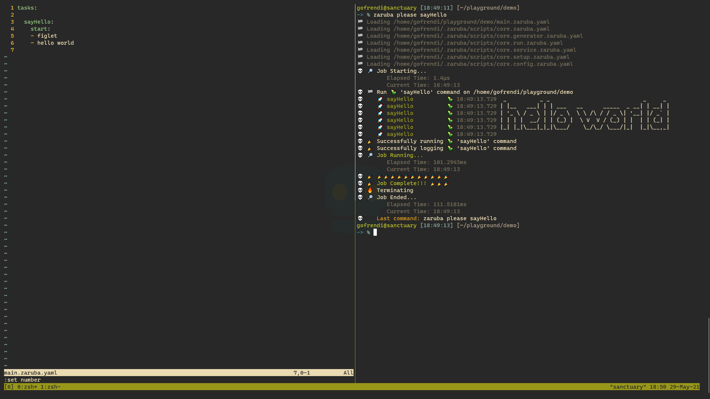
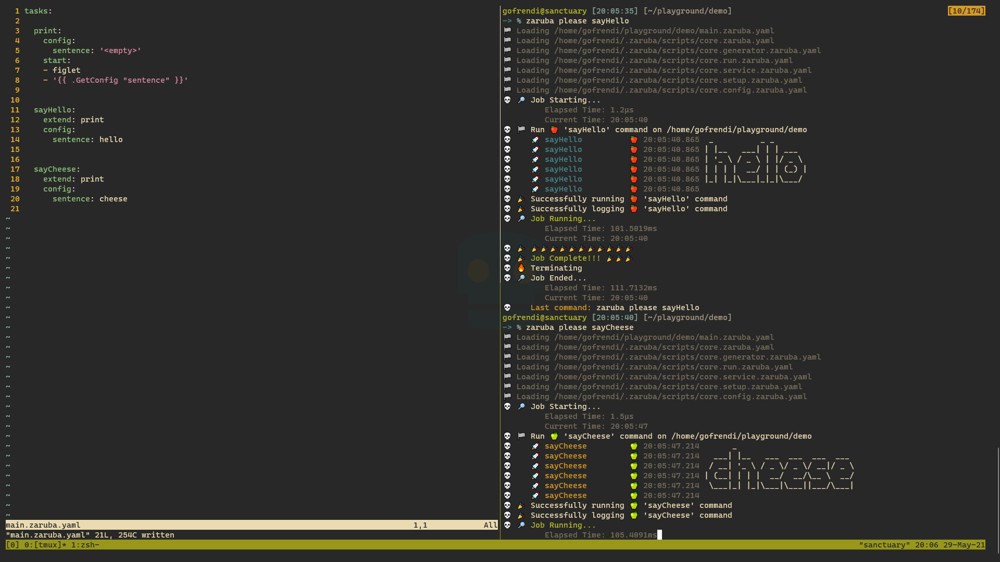
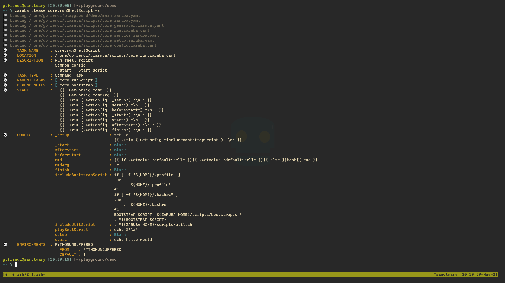
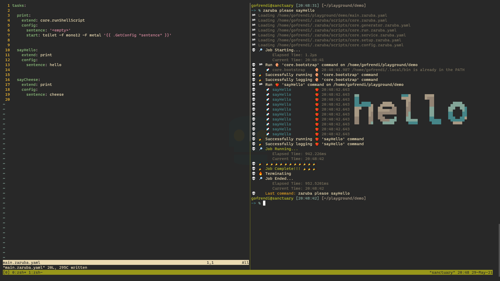
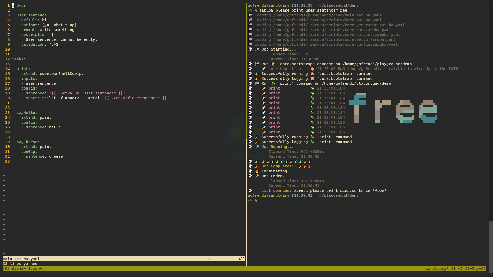
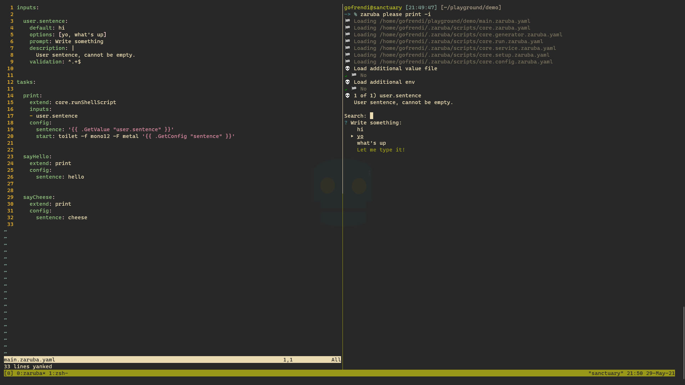
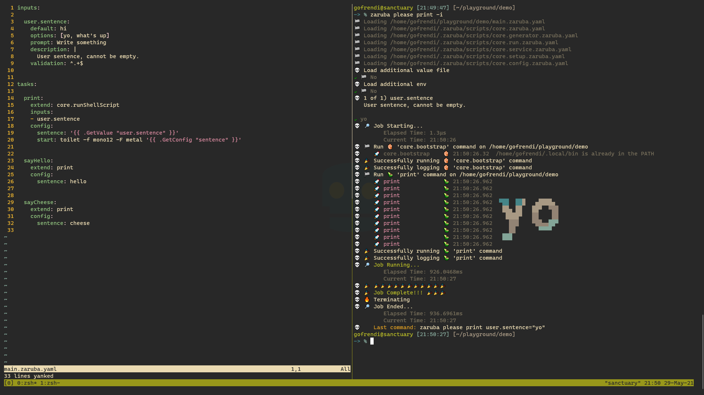
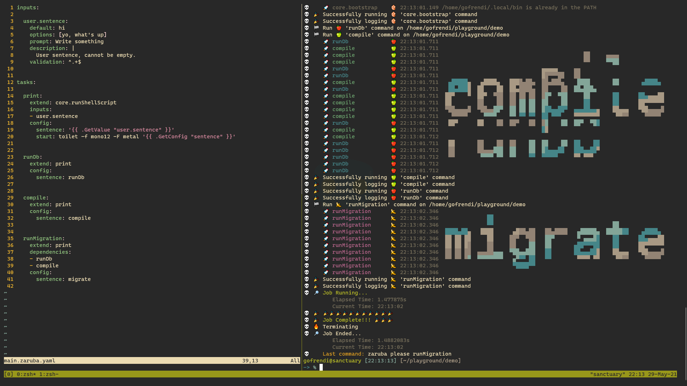

# ⚗️ Project

Project is a container for tasks, environments, and configurations. A project consists of several Zaruba scripts and all necessary resources.

Your main Zaruba script should be located at `main.zaruba.yaml`.

Every Zaruba script contains several optional keys:

```yaml
name: yourProjectName # optional
includes: [] # included Zaruba scripts
tasks: [] # task definitions
inputs: {} # Inputs
configs: {} # Map of configuration set
lconfigs: {}  # Map of list-configuration set
envs: {} # Map of environment set
```

* 🍲 `includes`: List of Zaruba scripts you want to include. Every scripts included in `main.zaruba.yaml` are automatically linked to each others.
* ✔️ `tasks`: Map of task definitions.
* 🔢 `inputs`: Map of predefined values that can be configured on runtime (interactively or by parameters). Inputs can be shared among tasks (i.e: several tasks probably access the same input).
* 📕 `configs`: Map of config set. Each config should have a single value. Several tasks probably depend on the same config set.
* 📚 `lconfigs`: Map of lconfig set. Each lconfig might have multiple values. Serveral tasks probably depend on the same lconfig set.
* 🛤️ `envs`: Map of environments. Several tasks probably depend on the same env set.

# 🍲 Includes

Some of your tasks probably need some resources from other Zaruba script.

Include mechanism allows you to include other Zaruba script file into your main script. Every zaruba scripts included in your main script will be automatically linked to each other. Thus, you only need to put `includes` in your `main.zaruba.yaml`.

For example you want to include resources from `./zaruba-tasks/my-other-project-file.zaruba.yaml` and `${HOME}/common-task.zaruba.yaml`. In that case, you can put this in your `main.zaruba.yaml`.

```yaml
includes:
- zaruba-tasks/my-other-project-file.zaruba.yaml
- ${HOME}/common-task.yaml
```

## 🌍 Global Include

If you want your scripts to be available from every project in your computer, you can add them into `ZARUBA_SCRIPT` environment. Please make sure that your script paths are absolute.

For example you want `${HOME}/common-task.zaruba.yaml` and `${HOME}/make-coffee.zaruba.yaml`. In that case, you can put this in your `.profile`, `.bashrc`, or `.zshrc`:

```sh
export ZARUBA_SCRIPT=${HOME}/common-task.zaruba.yaml:${HOME}/make-coffee.zaruba.yaml
```

This trick is going to be useful if you have common stateless tools like scaffolding or cofee-maker-automation that should be accessible from anywhere. Otherwise, local include (i.e: using `includes` key in your main project) is preferable.

# ✔️ Tasks

A project typically has more than one tasks that extend/depend to each other. A task typically contains several optional keys:

```yaml
tasks:

  taskName:
    location: ./task-location
    description: task's description
    extend: parentTaskName # use "extends" for multiple values
    timeout: 1h
    private: false
    inputs: [] # list of input's name
    dependencies: [] # tasks's dependencies
    envRef: envRefName # use "envRefs" for multiple values
    env: {}
    configRef: configRefName # use "configRefs" for multiple values
    config: {}
    lconfigRef: lconfigRefName # use "lconfigRefs" for multiple values
    lconfig: {}
    start: [] # start command
    check: [] # check command
```

* 📍 `location`: Task location, relative to your current project file path. For example, if your project file path is `~/project/zaruba-tasks/service.yaml` and you set the `location` to be `../service`, then your task location is `~/project/service`.
* 📜 `description`: Multi line text describing the task.
* 🔼 `extend`: Parent task name. Mutually exclusive to `extends` (i.e: You cannot use  both simultaneously).
* 🔼 `extends`: List of parent task names. Mutually exclusive to `extend` (i.e: You cannot use both simultaneously). 
* ⏰ `timeout`: The duration before a task is considered timeout. Timeout contains a possitive number or zero and followed by any of this suffix: "ns", "us" (or "µs"), "ms", "s", "m", "h".
* 🔒 `private`: Boolean, define whether your task is private or not. Private tasks are interactively inaccessible. Usually private tasks act as template to be extended by other tasks.
* 🔢 `inputs`: List of input names you want to associate with the task.
* 🔀 `dependencies`: Task dependencies. Zaruba will make sure that all dependencies are completed before starting the task.
* 🛤️ `envRef`: Environment reference to be used in the task. Mutually exclusive to `envRefs` (i.e: you cannot use both simultaneously).
* 🛤️ `envRefs`: List of environment references to be used in the task. Mutually exclusive to `envRef`(i.e: you cannot use both simultaneously).
* 🛤️ `env`: Task environment. This will override `envRef` or `envRefs`.
* 📕 `configRef`: Config reference to be used in the task. Mutually exclusive to `configRefs` (i.e: you cannot use both simultaneously).
* 📕 `configRefs`: List of configuration references to be used in the task. Mutually exclusive to `configRef`(i.e: you cannot use both simultaneously).
* 📕 `config`: Task configuration. This will override `configRef` or `configRefs`.
* 📚 `lconfigRef`: Lconfig reference to be used in the task. Mutually exclusive to `lconfigRefs` (i.e: you cannot use both simultaneously).
* 📚 `lconfigRefs`: List of lconfig references to be used in the task. Mutually exclusive to `lconfigRef`(i.e: you cannot use both simultaneously).
* 📚 `lconfig`: Task lconfig. This will override `lconfigRef` or `lconfigRefs`. Unlike `config`, a `lconfig` might contain several values (e.g: ports to be exposed, list of authors, etc).
* 🚀 `start`: Task's start command.
* 🔎 `check`: Task's check command.

Let's get into them, one drop at a time.

## ☘️ Task Type

There are three different task types in Zaruba:

* 🚀 `Command Task`: Short command. Terminated upon completion. To make a command task, you should provide `start` command and leave `check` command empty.
* 🏁 `Service Task`: Long running process. Keep running after completion. To make a service task, you should provide both `start` and `check` command.
* 📦 `Wrapper Task`: A task that wrap another tasks as it's dependencies, but doing nothing on it's own (no `start` or `check` command).

## 🚀 Command Task

At the very basic, a command task should contain a single `start` command. A command task is considered "completed" once the command has been executed.

Please take a look at the following example:

```yaml
# Filename: main.zaruba.yaml
tasks:

  sayHello:
    start:
    - figlet
    - hello world
```

We have `sayHello` task with single `start` command: `[figlet, hello world]`.

You can run the task by invoking:

```sh
zaruba please sayHello
```


> __Fun fact:__ Figlet is a program for making large letters out of ordinary text. If you are using ubuntu, you can install figlet by invoking `sudo apt-get install figlet`. Visit [figlet official website](http://www.figlet.org/) for more information.

## 📕 Config

You can make your task more configurable by adding `config` to it. Let's see the following example:

```yaml
# Filename: main.zaruba.yaml
tasks:

  print:
    config:
      sentence: hello world
    start:
    - figlet
    - '{{ .GetConfig "sentence" }}'
```

Now you can modify the sentence without touching the `start` command.

You can think of `config` as `attribute` or `property` in object-oriented programming. On its own, `config` is not very useful. To see how powerful it is, you need to combine it with `extend`.

To get a `config` value, you can use `{{ .GetConfig "configName" }}`.

> __Note:__ You can use [go template](https://golang.org/pkg/text/template/) in every `config` value, `lconfig` value, `start` command, and `check` command.

## 🔼 Extend

Just like in object-oriented programming, you can use `extend` to extend your task. Let's check the following example:

```yaml
# Filename: main.zaruba.yaml
tasks:

  print:
    config:
      sentence: '<empty>'
    start:
    - figlet
    - '{{ .GetConfig "sentence" }}'

  
  sayHello:
    extend: print
    config:
      sentence: hello
  

  sayCheese:
    extend: print
    config:
      sentence: cheese
```

Now we have `sayHello` and `sayCheese`. Just as their parent (i.e: `print`), both tasks will invoke `figlet` as well. However, since they have different `sentence` config, those two tasks will yield different results as well.

```sh
zaruba please sayHello
zaruba please sayCheese
```



Using `extend` is not only save you from writing the same parts over and over. It also allows you to change task's implementation without affecting it's children.

## 🔼 Extending core.runShellScript

Let's say you want to use [toilet](https://github.com/cacalabs/toilet) instead of figlet, then you can modify `print` task as follow:

```yaml
# Filename: main.zaruba.yaml
tasks:

  print:
    config:
      sentence: '<empty>'
    start:
    - bash
    - '-c'
    - toilet -f mono12 -F metal '{{ .GetConfig "sentence" }}'
```

Looks good. But, before we continue any further, try to run `zaruba please core.runShellScript -x`. 



`core.runShellScript` is part of zaruba's core tasks. Core tasks are always accessible from anywhere.

Based on the explanation, you can see that `core.runShellScript` has several `config` values. You can use those configurations (i.e: `setup`, `beforeStart`, `start`, `afterStart`, `cmd`, and `cmdArg`) to configure the `start` command.

In our case, we can simply extend `core.runShellScript` and override it's `start` config:

```yaml
# Filename: main.zaruba.yaml
tasks:

  print:
    extend: core.runShellScript
    config:
      sentence: '<empty>'
      start: toilet -f mono12 -F metal '{{ .GetConfig "sentence" }}'

  
  sayHello:
    extend: print
    config:
      sentence: hello
  

  sayCheese:
    extend: print
    config:
      sentence: cheese
```

So, here is how things look like:



## 🔢 Inputs

Since our `print` task is configurable, you can extend it and make as many tasks as you need. However, you can also use `inputs` to let your user customize your configuration.

Let's check out the following example:

```yaml
# Filename: main.zaruba.yaml
inputs:

  user.sentence:
    default: hi
    options: [yo, what's up]
    prompt: Write something
    description: |
      User sentence, cannot be empty.
    validation: ^.+$


tasks:

  print:
    extend: core.runShellScript
    inputs:
    - user.sentence
    config:
      sentence: '{{ .GetValue "user.sentence" }}'
      start: toilet -f mono12 -F metal '{{ .GetConfig "sentence" }}'

  
  sayHello:
    extend: print
    config:
      sentence: hello
  

  sayCheese:
    extend: print
    config:
      sentence: cheese
```

Now you have an input named `user.sentence`. It's value cannot be blank since the [regex](http://www.regular-expressions.info/) `validation` require at least a single character (`^.+$`). By default, the input value is `hi`, but you can set it to anything. If you use `interactive` mode, then you will find `yo` and `what's up` as optional values.

In order to set the value, you can run the task with `parameter` or `interactively`.

> __Note__: The run task with parameters is preferable if you want to run the Zaruba task from your CI/CD or other automation tools. Meanwhile, run task interactively allows you to use lesser muscle memory.

### Run with parameter

```sh
zaruba please print user.sentence=free
```




### Run interactively

```sh
zaruba please print -i
```

When you run a task interactively, Zaruba will ask you to set your input's value.



It will then run the task based on your input.



## 🔀 Dependencies

In real life, tasks might depend on each others. For example, you cannot run a database migration before the database server is running.

To declare task dependencies, you can use `dependencies` key:

```yaml
# Filename: main.zaruba.yaml
inputs:

  user.sentence:
    default: hi
    options: [yo, what's up]
    prompt: Write something
    description: |
      User sentence, cannot be empty.
    validation: ^.+$


tasks:

  print:
    extend: core.runShellScript
    inputs:
    - user.sentence
    config:
      sentence: '{{ .GetValue "user.sentence" }}'
      start: toilet -f mono12 -F metal '{{ .GetConfig "sentence" }}'

  
  runDb:
    extend: print
    config:
      sentence: runDb


  compile:
    extend: print
    config:
      sentence: compile
  

  runMigration:
    extend: print
    dependencies:
    - runDb
    - compile
    config:
      sentence: migrate
```

`runMigration` depends on both `runDb` and `compile`. That's mean that `runMigration` won't be started before `runDb` and `compile` are completed.

When you invoke `runMigration`, Zaruba will automatically run it's dependencies tasks (`runDb` and `compile`) in parallel/concurrently.

```sh
zaruba please runMigration
```



Notice that `compile` and `runDb` outputs are interlaced to each other since they run in parallel.

## Environment

## LConfig

## Service Task

## Docker Task

# What's next

* [Running tasks](running-task.md)
* [Creating service task](creating-service-task.md)
* [Creating docker task](creating-docker-task.md)
* [Creating Fast API service](creating-fast-api-service.md)
