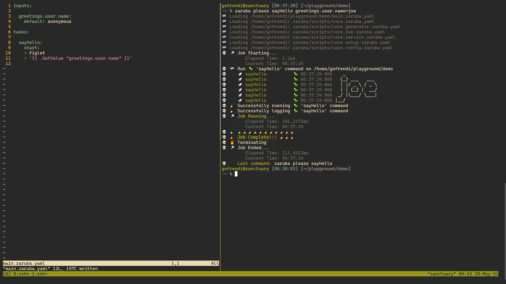
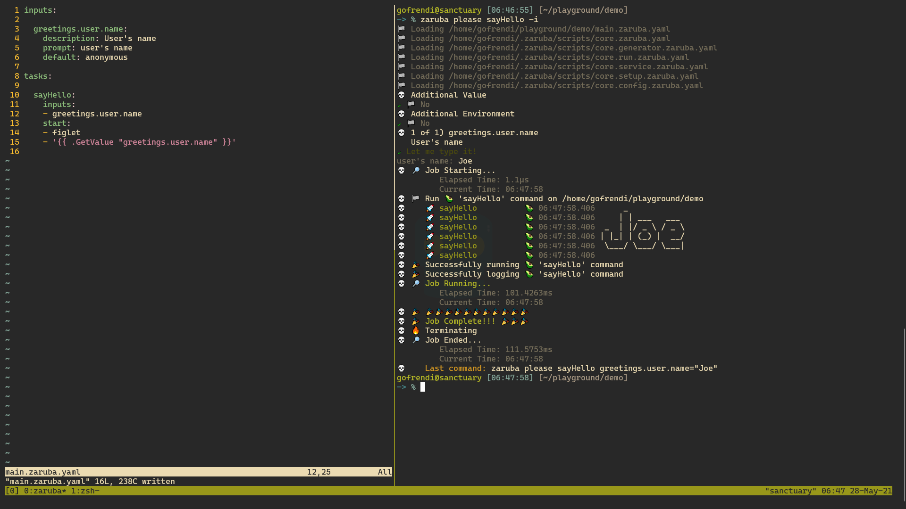

# Project

Project is a container for tasks, environments, and configurations. It is a git repository containing `main.zaruba.yaml`.

`main.zaruba.yaml` typically contains several optional keys:

```yaml
includes: []
inputs: {}
tasks: []
configs: {}
lconfigs: {}
envs: {}
```

* `includes`: Other project files you want to include into your project.
* `inputs`: Predefined values that can be configured interactively or by parameters.
* `tasks`: Task definitions.
* `configs`: Global configuration that can be shared among related tasks. The value of the configuration are `string`.
* `lconfigs`: Global configuration that can be shared among related tasks. The value of the configuration are `list of string`.
* `envs`: Global environments that can be shared among related tasks.

# Includes

`main.zaruba.yaml` might include other project files (any file with `*.zaruba.yaml` extension). To include other project file, you can declare the following:

```yaml
includes:
- zaruba-tasks/my-other-project-file.zaruba.yaml
- ${HOME}/common-task.yaml
```

Using `includes` is highly recommended, since it helps you to make your project more managable.

Take note that you only need to set `includes` value in your `main.zaruba.yaml`.

# Tasks

A project typically has more than one tasks that extend/depend to each other. A task typically contains several optional keys:

```yaml
tasks:

  taskName:
    location: ./task-location
    description: task's description
    extend: parentTaskName # use "extends" for multiple values
    timeout: 1h
    private: false
    inputs: []
    dependencies: [] # tasks's dependencies
    envRef: envRefName # use "envRefs" for multiple values
    env: {}
    configRef: configRefName # use "configRefs" for multiple values
    config: {}
    lconfigRef: lconfigRefName # use "lconfigRefs" for multiple values
    lconfig: {}
    start: [] # start command
    check: [] # check command
```

You can configure tasks by manipulating those keys

* `location`: Task location, relative to your current project file path. For example, if your project file path is `~/project/zaruba-tasks/service.yaml` and you set the `location` to be `../service`, then your task location is `~/project/service`.
* `description`: Multi line text describing the task.
* `extend`: Parent task name.
* `extends`: Mutually exclusive to `extend`. Indicating you have multiple parent tasks.
* `timeout`: The duration before a task is considered timeout. It contains a possitive number and followed by any of this suffix: "ns", "us" (or "µs"), "ms", "s", "m", "h".
* `private`: Either your task is private (cannot be accessed interactively) or not.
* `inputs`: Inputs you want to include when running the task interactively.
* `dependencies`: Task dependencies. You put all dependency's task name here. Zaruba will make sure that all dependencies are completed before starting a task.
* `envRef`: environment reference. Containing keys of project's `envs`.
* `envRefs`: Mutually exclusive to `envRef`. Indicating you have multiple environment reference
* `env`: Task environment.
* `configRef`: Configuration reference. Containing keys of project's `configs`.
* `configRefs`: Mutually exclusive to `configRef`. Indicating you have multiple configuration reference
* `config`: Task configuration
* `lconfigRef`: List configuration reference. Containing keys of project's `lconfigs`.
* `lconfigRefs`: Mutually exclusive to `lconfigRef`. Indicating you have multiple list configuration reference
* `lconfig`: Task list configuration

# Inputs

Inputs are predefined value that can be configured interactively, by parameter, or by value file.

Input declaration looks like this:

```yaml
inputs:

  inputName:
    description: |
      Description about the input.
      Can be multi-line
    prompt: Single line prompt message
    default: defaultValue
    options: [alternativeValue, otherAlternativeValue]
    validation: ^.*$ # regex pattern for value validation
```

## Getting input's value

To use input's value from your task, you can use `.GetValue` method in your task declaration. For example:

```yaml

inputs:

  greetings.user.name:
    default: anonymous

tasks:

  sayHello:
    start:
    - figlet
    - '{{ .GetValue "greetings.user.name" }}'
```

You can then try to set input value using parameter like this:

```sh
zaruba please sayHello greetings.user.name=joe
```



Input values are shared among tasks. In a way it helps you to not repeating yourself by declaring different input names for every task. But this also mean that your input's name should be unique. You can help yourself by adding prefix to your input. For example, instead of `name`, you put `greetings.user.name` instead.

## Using input on interactive mode

Most likely users won't be able to memorize every input's name. This is why Zaruba provide interactive mode.

To make your inputs available interactively, you can add them as task's input:

```
inputs:

  greetings.user.name:
    description: User's name
    prompt: user's name
    default: anonymous

tasks:

  sayHello:
    inputs:
    - greetings.user.name
    start:
    - figlet
    - '{{ .GetValue "greetings.user.name" }}'
```

You can then try to run the task interactively using `-i` or `--interactive` flag:

```sh
zaruba please sayHello -i
```




# Task

in zaruba, everything is written in [YAML](https://yaml.org/), Here is a very basic structure of a task:

```yaml
tasks:

    yourTaskName:
        dependencies: [] # List of task dependency's name
        start: [] # list of argument to start a task
        check: [] # list of argument to check whether the task is ready or not
```

## Command task

Let's start with a simple command task to show "hello world" in your screen:

```yaml
tasks:

  sayHello:
    start:
    - echo
    - hello world
```

That's it. Save it to your `main.zaruba.yaml` (you might need to [init project](creating-a-project.md)) and run it by invoking `zaruba please sayHello`.

## Service task

Sometime you need to run a task that keep running in the background (e.g: web server, database server, etc).

In that case, you need to be able to determine whether the background service is ready or not.

For example, you want to start a static web server by using python `http.server` utility on port 9000. Here is what you need to write:

```yaml
tasks:
  
  runServer:
    start: [python, -m, http.server, 9000]
    check:
    - bash
    - '-c'
    - |
      until nc -z localhost 9000
      do
          sleep 1
      done
```

Here is how it works:

* First, zaruba will start the server by running `python -m http.server 9000`
* At the same time, zaruba will also run the check command. The check command is a loop control structure that will keep running until `localhost:9000` is ready.
* Once the check command has been complete, zaruba will consider the task as `complete`. It will proceed with other tasks that depend on this one.

That's it. Save the task to your `main.zaruba.yaml` and run it by invoking `zaruba please runServer`. Notice that task will keep running until your press `ctrl+c` to terminate it.

## Task with dependencies

In some cases you need to make sure that other tasks are ready/completed before running a particular task (e.g: in order to run an integration test, you need to make sure that all databases/services/migrations are ready).

Let's say you want to run `curl` after `runServer` and `sayHello` is ready. Here is how you do it:

```yaml
tasks:

  sayHello:
    start:
    - echo
    - hello world


  runServer:
    start: [python, -m, http.server, 9000]
    check:
    - bash
    - '-c'
    - |
      until nc -z localhost 9000
      do
          sleep 1
      done
  

  invokeCurl:
    dependencies:
    - sayHello
    - runServer
    start: [curl, http://localhost:9000]
```

After save those tasks in your `main.zaruba.yaml`, you can run everything by invoking `zaruba please invokeCurl`.

Since `invokeCurl` have `sayHello` and `runServer` as dependencies, zaruba will run the dependencies first before starting `invokeCurl`. The dependencies will be executed in parallel.

For things like integration test, you probably want to automatically kill everything once the test was completed. You can do this by adding `-t` argument like this: `zaruba please invokeCurl -t`. For more information about how to run tasks, plese visit [this page](running-tasks.md)


## Environment and configurations

At some point, you probably need to make your tasks configurable. You can achieve this by using environment, config, and lconfig:

```yaml
tasks:

  yourTaskName:
    env:
      KEY:
        from: GLOBAL_KEY
        default: defaultValue
    config:
      key: value
    lconfig:
      key: [value1, value2, value3]
```

In order to parse environment, config, and lconfig, you can use zaruba's built-in [go template](https://golang.org/pkg/text/template/) functions: `GetEnv`, `GetConfig`, and `GetLConfig`.

You can use go-template in every config's value, lconfig's value, env's default, start's value, and check's value.

Let's see the following example:

```yaml
tasks:

  runServer:
    env:
      PORT:
        from: SERVER_PORT
        default: 3000
    lconfig:
      authors:
      - Sheldon
      - Howard
    config:
      dirPath: ./portempa
      startScript: |
        # composing HTML
        HTML="<p>This page is running on port {{ .GetEnv "PORT" }}</p>"
        AUTHORS=''
        {{ range $index, $author := .GetLConfig "authors" }}
          AUTHORS="${AUTHORS}{{ $author }}, "
        {{ end }}
        HTML="${HTML}<p>Authors: ${AUTHORS} 2021</p>"

        # write HTML and save it to dir
        mkdir -p '{{ .GetConfig "dirPath" }}'
        echo "$HTML" > '{{ .GetConfig "dirPath" }}/index.html'

        # start server
        cd '{{ .GetConfig "dirPath" }}'
        python -m http.server {{ .GetEnv "PORT" }}
      checkScript: |
        until nc -z localhost $PORT
        do
            sleep 1
        done
        echo Web server is ready at port $PORT
    start: [bash, -c, '{{ .GetConfig "startScript" }}']
    check: [bash, -c, '{{ .GetConfig "checkScript" }}']
```

As always, you can run the task by invoking `zaruba please runServer`

Now let's dive into the example.

### Env

First of all, we have `env`. Environment variable is usually used to configure your application at runtime. In zaruba, you can make use of environment variable by providing `env` key.

This part basically tells zaruba that we want to use an environment variable named `PORT` in our task. The value of the variable is going to be taken from `SERVER_PORT` variable if it was set. Otherwise, it will take default value `3000`.

```yaml
env:
  PORT:
    from: SERVER_PORT
    default: 3000
```

### Config

Config is a key-value pair that can be used to make your tasks more configurable. For example, we want to have `./portempa` as temporary directory to serve our HTML (fun fact: portempa means temporary in esperanto).

Any valid string can be used as config's value, including bash script. Let's check our `startScript` config a bit.

The script consists of 3 logical parts:

* composing HTML
* write HTML
* start server

The `composing HTML` part contains more logic than the others.

```bash
HTML="<p>This page is running on port {{ .GetEnv "PORT" }}</p>"
AUTHORS=''
{{ range $index, $author := .GetLConfig "authors" }}
  AUTHORS="${AUTHORS}{{ $author }}, "
{{ end }}
HTML="${HTML}<p>Authors: ${AUTHORS} 2021</p>"
```

First of all, we initiate a variable named `HTML`. It contains a single paragraph to tell the user about the port we used to run the server. Notice the `{{ .GetEnv "PORT" }}` part. That's how you include environment value.

Next, we have a go-template loop to populate `AUTHORS`. The value of the authors is taken from `authors` lconfig (which is an array).

At the end of this part, we add `AUTHORS` into `HTML`.

After `HTML` variable is completely set, we then try put it into `index.html` in a `dirPath`. 

```bash
mkdir -p '{{ .GetConfig "dirPath" }}'
echo "$HTML" > '{{ .GetConfig "dirPath" }}/index.html'
```

Take note that you can get the value of other config (for example, here you try to get the value `dirPath` config and use it in your `startScript` config). This make things quite flexible, yet prone to circular recursive. In order to avoid stack overflow, zaruba will throw error once a recursive call count is passing some threshold.

Finally, you need to start the server

```bash
cd '{{ .GetConfig "dirPath" }}'
python -m http.server {{ .GetEnv "PORT" }}
```

Putting the start and check script as `config` is a good practice since it allows other to extend your task easily.

### Lconfig

LConfig is like config, but instead of string, it has array as it's value. In our case, we have several `authors`, so it is make sense to put the authors name on lconfig.


## Sharing environment and configurations

When your tasks starting to connect to each others, they will likely need to share environments and configurations.

For example, either you run a service directly or as container, some environments are likely used by those two tasks.

To share environments and configurations among tasks you can use `envRef`, `envRefs`, `configRef`, `configRefs`, `lconfigRef`, and `lconfigRefs`:

```yaml
tasks:

  yourFirstTask:
    envRef: yourEnvRef
    configRef: yourConfigRef
    lconfigRef: yourLConfigRef
  

  yourSecondTask:
    envRefs: [yourEnvRef, otherEnvRef]
    configRefs: [yourConfigRef, otherConfigRef]
    lconfigRefs: [yourLConfigRef, otherLConfigRef]


envs:

  yourEnvRef:
    YOUR_KEY:
      default: yourValue
  

  otherEnvRef:
    YOUR_OTHER_KEY:
      default: yourOtherValue
    SOME_OTHER_KEY:
      default: someOtherValue

  
configs:

  yourConfigRef:
    key: value
  

  otherConfigRef:
    otherKey: otherValue
    someOtherKey: someOtherValue


lconfigs:

  yourLConfigRef:
    key: [value1, value2]
  

  otherLConfigRef:
    otherKey: [otherValue1, otherValue2]
    someOtherKey: [someOtherValue1, someOtherValue2]

```

To use multiple environment reference by using `envRefs` instead of `envRef`. Similarly you can use `configRefs` instead of `configRef`, and `lconfigRefs` instead of `lconfigRef`. For the record, those key pairs are mutually exclusive (i.e: you cannot use `envRef` and `envRefs` simultaneously in a single task).

Let's see an example:

```yaml
tasks:

  runRedis:
    configRefs: [redis, redisCheck]
    config:
      startScript: |
        docker run --name {{ .GetConfig "containerName" }} {{ .GetConfig "imageName" }} 
    start: [bash, -c, '{{ .GetConfig "startScript" }}']
    check: [bash, -c, '{{ .GetConfig "checkScript" }}']
  

  startRedis:
    configRefs: [redis, redisCheck]
    config:
      startScript: |
        docker start {{ .GetConfig "containerName" }}
    start: [bash, -c, '{{ .GetConfig "startScript" }}']
    check: [bash, -c, '{{ .GetConfig "checkScript" }}']


  stopRedis:
    configRef: redis
    config:
      startScript: |
        docker stop {{ .GetConfig "containerName" }}
    start: [bash, -c, '{{ .GetConfig "startScript" }}']


configs:

  redis:
    containerName: redis
    imageName: redis
  

  redisCheck:
    checkScript: |
      until nc -z localhost 5679
      do
          sleep 1
      done
      echo "redis run"
```

You can see that `runRedis` and `startRedis` use two configRef: `redis` and `redisCheck`. Additionally, they have their own `startScript`.

On the other hand, `stopRedis` only use `redis` configRef. Thus:

*  `containername` and `imageName` is shared by 3 tasks, `runRedis`, `startRedis`, and `stopRedis`.
* `checkScript` is only shared by 2 tasks, `runRedis` and `startRedis`.

## Extend tasks

Sometimes you need to do more than just sharing environments/configurations. Zaruba supports task inheritance just like OOP.

In order to create a task that inherit from the other task, you can either use `extend` or `extends`.

```yaml
tasks:

  parentTaskAlpha: {}
  parentTaskBeta: {}

  task1:
    extend: parentTaskAlpha
  
  task2:
    extends: [parentTaskAlpha, parentTaskBeta]
```

At it's core you can use inheritance to encapsulate complexity, thus providing simpler layer to fellow developers (and your future self). Let's take a look at this example

```yaml
tasks:

  base.run:
    config:
      cmd: bash
      cmdArg: '-c'
      start: ""
    start:
    - '{{ .GetConfig "cmd" }}'
    - '{{ .GetConfig "cmdArg" }}'
    - |
      set -e
      {{ .GetConfig "start" }}
  

  runEcho:
    extend: base.run
    config:
      start: echo hello world

  
  runCurl:
    extend: base.run
    config:
      start: curl http://localhost:80
  

  base.nodeRun:
    extend: base.run
    config:
      cmd: node
      cmdArg: '-p'

  
  runConsoleLog:
    extend: base.nodeRun
    config:
      start: console.log("hello world");
```

By defining `start` and some `config` at `base.run`, you can save yourself for writing the same thing on `runEcho` and `runCurl`. `runEcho` and `runCurl` are both extended (or inherited) from `base.run`.

Furthermore, you can also override anything defined by parent task. In our case, `base.nodeRun` override `cmd` and `cmdArg`. In a more intuitive way, we can say this:

* `base.nodeRun` is basically `base.run`.
* But instead of `bash`, we have `node` as it's `cmd` config.
* Similarly, we have `-p` instead of `-c` as it's `cmdArg`.

Most of zaruba's generated tasks are extending one or more parent task.

## Include zaruba script

The more you add tasks to your project, the bigger your file become. But don't worry, you can put your tasks into separated files and load them in your `main.zaruba.yaml`.

For example:

```yaml
includes:
- ./my-task.zaruba.yaml
```

You only need to include other zaruba scripts in your `main.zaruba.yaml`. The included scripts will be interconnected to each others. By default, zaruba will also include `${ZARUBA_HOME}/scripts/core.zaruba.yaml`

## What's next

* [Running tasks](running-task.md)
* [Creating service task](creating-service-task.md)
* [Creating docker task](creating-docker-task.md)
* [Creating Fast API service](creating-fast-api-service.md)
