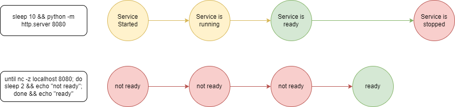

[⬆️](./README.md)

# Tasks

Tasks are the core of your zaruba script. A task define what Zaruba can do and how to do it.

Let's start by creating a very simple script.

```
gofrendi@sanctuary [17:07:47] [~/playground/example]
-> % cat > index.zaruba.yaml << EOF
heredoc> tasks:
heredoc>   sayHello:
heredoc>     start: [figlet, hello]
heredoc> EOF
```

and executing it:

```
gofrendi@sanctuary [17:12:33] [~/playground/example]
-> % zaruba please sayHello
💀 🔎 Job Starting...
         Elapsed Time: 1.3µs
         Current Time: 17:12:49
💀 🏁 Run 🍏 'sayHello' command on /home/gofrendi/playground/example
💀    🚀 sayHello             🍏 17:12:49.475  _          _ _
💀    🚀 sayHello             🍏 17:12:49.475 | |__   ___| | | ___
💀    🚀 sayHello             🍏 17:12:49.475 | '_ \ / _ \ | |/ _ \
💀    🚀 sayHello             🍏 17:12:49.475 | | | |  __/ | | (_) |
💀    🚀 sayHello             🍏 17:12:49.475 |_| |_|\___|_|_|\___/
💀    🚀 sayHello             🍏 17:12:49.475
💀 🎉 Successfully running 🍏 'sayHello' command
💀 🔎 Job Running...
         Elapsed Time: 106.3051ms
         Current Time: 17:12:49
💀 🎉 🎉🎉🎉🎉🎉🎉🎉🎉🎉🎉🎉
💀 🎉 Job Complete!!! 🎉🎉🎉
💀 🔥 Terminating
💀 🔎 Job Ended...
         Elapsed Time: 216.7833ms
         Current Time: 17:12:49
```

Perfect.

Now let's see how this really works:

```yaml
tasks:
  sayHello:
    start: [figlet, hello]
```

The script contains a single task named `sayHello` that has `start` property. This `start` property is an array containing two elements: `figlet`, and `hello`. The first element of this array should refer to a binnary or executable path, while the others elements should contains parameters to run the executable.

At the beginning, you will find this approach looks too complicated, but please bear with me until the end to see how this actually gives you advantage later.

Now let's dive into the anatomy of a task:

## Task anatomy

A task might contains several properties. We will learn the purpose of each properties later, but for now here is a list of those properties:


> 💡 __PRO TIPS:__ Skip this list, scroll to [task example section](#task-example) first. Jump back to this list if you find something doesn't make sense.  

* `icon`: Emoji representing a task. You can put any character as task's icon, but there is no better way than copy-pasting your favorit emoji from [emojipedia](https://emojipedia.org/).
* `location`: The location path you want your tasks to be run from. If you don't specify task's location, then Zaruba will use your current location.
* `description`: The description of your task. Can be multiline.
* `extend` or `extends`: Your task's parent name(s). These properties cannot be used simultaneously.
    * `extend`: Your task's parent name
    * `extends`: List of your tasks's parent names.
* `timeout`: The duration Zaruba should wait before a task is considered as failing. Timeout contains a possitive number or zero and followed by any of this suffix: "ns", "us" (or "µs"), "ms", "s", "m", "h".
* `private`: Boolean value to represent whether your task is private or not. Private tasks are interactively inaccessible. Usually private tasks act as template to be extended by other tasks.
* `autoTerminate`: Boolean value to represent whether your task intended to be auto-terminated.
* `saveLog`: Whether output/error of this task should be logged or not
* `syncEnv`: Whether this task environment should be updated when there is new environment variable in any `*.env` file in task location. To trigger the changes, you need to perform `zaruba please syncEnv`.
* `inputs`: List of input names you want to associate with your task.
* `dependencies`: Task dependencies. Zaruba will make sure that all dependencies of a task are completed before starting one.
* `envRef` or `envRefs`: Your task's environment reference(s). These properties cannot be used simultaneously.
    * `envRef`: Name of environment you want to use for your task.
    * `envRefs`: List of environments you want to use for your task.
* `env`: Task environment. Any environment you declare in this property will override anything defined in your `envRef` or `envRefs`.
* `configRef` or `configRefs`: Your task's configuration reference(s). These properties cannot be used simultaneously.
    * `configRef`: Name of configuration you want to use for your task.
    * `configRefs`: List of configuration you want to use for your task.
* `config`: Task configuration. Any configuration you declare in this property will override `configRef` or `configRefs`.
* `start`: Task's start command.
* `check`: Command to check whether start command can be considered "ready" or not. This property is used to check the readiness of a long running service. See [this section](#lower-level-approach) to see how it works.

## Task example

Let's see an example:

```yaml
tasks:

  taskName:
    icon: 🎻
    location: ./task-location
    description: task's description
    extend: parentTaskName # use "extends" for multiple values
    timeout: 1h # If the task takes more than 1 hour, it is considered failed
    private: false # This task means to be executed by end user
    autoTerminate: false # This task will keep on running after ready
    saveLog: true # Every output/error of this task should be logged
    syncEnv: true # Adjust environment with any `*.env` file in tash's location
    inputs: [] # list of input's name
    dependencies: [] # tasks's dependencies
    envRef: envRefName # use "envRefs" for multiple values
    envs:
      SOME_ENV:
        default: defaultValue # By default, SOME_ENV=defaultValue
        from: GLOBAL_ENV # If you set GLOBAL_ENV, then SOME_ENV=$GLOBAL_ENV
    configRef: configRefName # use "configRefs" for multiple values
    configs:
      configName: configValue
    start: [figlet, hello] # start command
    check: [] # check command
```

> 💡 __PRO TIPS:__ You can go back to [task anatomy section](#task-anatomy) to see more detail description about each properties.

## Running a simple command vs starting a long running service

To make things easier, let's first agree on two terminology: `simple command`, and `long running service`.

### Simple command

Simple command is something you run and considered `completed` once the process has been ended.

For example, `python -c "print('hello')"` is a command:

```
gofrendi@sanctuary [09:45:16] [~/playground/example]
-> % python -c "print('hello')"
hello
gofrendi@sanctuary [10:27:21] [~/playground/example]
-> %
```

We can see that once the process has been ended, the command is completed. When you compile your Go/Typescript/Java application you are definitely running a command (even if you don't really open a terminal).

### Long running service

Simple command is pretty intuitive and straightforward. But long running service on the other hand, has a very different nature.

A long running service might keep `running` forever until it is killed. A service is considered as `ready` when it serve what it intended to. You can have a service that already `running`, but doesn't `ready` to receive any request yet.

Web servers and database servers are definitely considered as long running services. Those services might run in the background automatically, thus less obviously visible by end user. But invisible doesn't mean inexistance. In fact, you can find long running service everywhere. Even your OS can be considered as a long running service. An OS always there, waiting for your inputs or external events, and act accordingly.

Now let's try running a static web service by invoking `python -m http.server 8080`.

```
gofrendi@sanctuary [10:31:47] [~/playground/example]
-> % python -m http.server 8080
Serving HTTP on 0.0.0.0 port 8080 (http://0.0.0.0:8080/) ...
```

You can see that the process doesn't immediately quit once it is started. It will wait any incoming http request to port 8080, giving a response, and wait again until the end of time (or until you press ctrl + C).

Okay coool, but how do you make sure that a service is ready?

You can make sure a service is ready by giving it a request and observe it's response. In our case, you can verify that the service is ready by openning a browser and visit `http://localhost:8080`.

Making sure that a service is ready can be tricky since `running` doesn't mean `ready`. To make it more complicated, even if a service is considered as `ready`, it doesn't always be in that state forever. Runtime error might occurred, and your service might stop serving eventhough it is still `running`. 

Orchestration system like kubernetes overcome this problem by periodically sending request to your services using `liveness` and `readiness` [probes](https://kubernetes.io/docs/tasks/configure-pod-container/configure-liveness-readiness-startup-probes/). But that's going to be another topic of discussion.

## Checking readiness of long running service

In the previous section you have see that handling a service and making sure it is already running can be a bit challenging.

Under the hood, Zaruba make sure that your service is ready by running two commands simultaneously. The first command is responsible to run the service, while the other one is responsible to check it's readiness. 

Let's see how this work on the low level.

First of all, you will need two terminals in the same computer. You can also use tmux/screen if you are familiar with those tools.

__Starter__

In your first terminal, you can spawn this command `sleep 10 && python -m http.server 8080`: 

```
gofrendi@sanctuary [11:07:54] [~/playground/example]
-> % sleep 10 && python -m http.server 8080
Serving HTTP on 0.0.0.0 port 8080 (http://0.0.0.0:8080/) ...
```

This command ask the computer to wait for 10 seconds before starting the web server. We use this to emulate real world cases. Some server might even take more than a minute to be ready. Also, those 10 seconds give you enough time to open the second terminal and invoke the service checker (if you are really that quick).

__Checker__

Our service checker contains a single loop to check whether `localhost:8080` is up and serving. In order to start the checker, you can invoke this in your second terminal `until nc -z localhost 8080; do sleep 2 && echo "not ready"; done && echo "ready"`:

```
gofrendi@sanctuary [11:07:56] [~/playground/example]
-> % until nc -z localhost 8080; do sleep 2 && echo "not ready"; done && echo "ready"
not ready
not ready
not ready
not ready
ready
gofrendi@sanctuary [11:32:44] [~/playground/example]
-> %
```

Great, now you can make sure that your service is really `ready` before deal with it any further.

> 💡 __TIPS:__  if you find the service is already started before you are able to start the checker, please feel free to change the sleep duration of the server (e.g: `sleep 30 && python -m http.server 8080`, will make the computer wait for 30 seconds before starting the server)

To see how our starter and checker works, let's take a look on this diagram:




## Starting a long running service with Zaruba

Unless you are a [starcraft](https://starcraft2.com/en-us/) pro player, probably running multiple terminals and tmux panels is not a very good idea.

You might also want to run the server in the background or make a docker container for this simple use case. But let's not do that.

We will use Zaruba instead.

### Lower level approach

First you declare this script in your `index.zaruba.yaml`

```yaml
tasks:

  startServer:
    start: [bash, -c, 'sleep 10 && python -m http.server 8080']
    check: [bash, -c, 'until nc -z localhost 8080; do sleep 2 && echo "not ready"; done && echo "ready"']
```

then, you can invoke `zaruba please startServer`.

```
gofrendi@sanctuary [12:11:35] [~/playground/example]
-> % zaruba please startServer
💀 🔎 Job Starting...
         Elapsed Time: 1.3µs
         Current Time: 12:11:54
💀 🏁 Run 🍏 'startServer' service on /home/gofrendi/playground/example
💀 🏁 Check 🍏 'startServer' readiness on /home/gofrendi/playground/example
💀    🔎 startServer          🍏 12:11:56.908 not ready
💀    🔎 startServer          🍏 12:11:58.91  not ready
💀    🔎 startServer          🍏 12:12:00.912 not ready
💀    🔎 startServer          🍏 12:12:02.92  not ready
💀    🔎 startServer          🍏 12:12:04.927 not ready
💀    🔎 startServer          🍏 12:12:06.932 not ready
💀    🔎 startServer          🍏 12:12:06.936 ready
💀 🎉 Successfully running 🍏 'startServer' readiness check
💀 🔎 Job Running...
         Elapsed Time: 12.1374875s
         Current Time: 12:12:07
         Active Process:
           * (PID=16029) 🍏 'startServer' service
💀 🎉 🎉🎉🎉🎉🎉🎉🎉🎉🎉🎉🎉
💀 🎉 Job Complete!!! 🎉🎉🎉
```

Good. This is what `check` property actually is for. It tells Zaruba how to check your service readiness. 

Any task with `start` and `check` property will be considered as `long running service`, while every tasks without `check` property are considered as `simple command`.

Please also take note that sometime a task might have `check` property eventhough it is not explicitly written. This is especially true if you [extend/inherit](#extending-a-task) your task from another task.
    
> 💡 __TIPS:__  You might wonder why the server log doesn't show up unless you terminate it with `ctrl + c`. This is happened because of python buffering mechanism. To turn off this feature, you can set `PYTHONUNBUFFERED` to `1`. (i.e: by using this as start command, `start: [bash, -c, 'sleep 10 && export PYTHONUNBUFFERED=1 && python -m http.server 8080']`)


### Higher level approach

The previous approach looks good. But in most cases, you will most likely see this instead:

```yaml
tasks:

  startServer:
    extend: zrbStartApp
    configs:
      start: sleep 10 && python -m http.server 8080
      ports: 8080
```

Let's try to modify your `index.zaruba.yaml` and invoke `zaruba please startServer`.

```
gofrendi@sanctuary [12:21:19] [~/playground/example]
-> % zaruba please startServer
💀 🔎 Job Starting...
         Elapsed Time: 1.8µs
         Current Time: 12:21:28
💀 🏁 Run 🔗 'updateProjectLinks' command on /home/gofrendi/playground/example
💀    🚀 updateProjectLinks   🔗 12:21:28.719 🎉🎉🎉
💀    🚀 updateProjectLinks   🔗 12:21:28.719 Links updated
💀 🎉 Successfully running 🔗 'updateProjectLinks' command
💀 🏁 Run 🍏 'startServer' service on /home/gofrendi/playground/example
💀 🏁 Check 🍏 'startServer' readiness on /home/gofrendi/playground/example
💀    🔎 startServer          🍏 12:21:29.015 📜 Waiting for port '8080'
💀    🚀 startServer          🍏 12:21:39.186 Serving HTTP on 0.0.0.0 port 8080 (http://0.0.0.0:8080/) ...
💀    🔎 startServer          🍏 12:21:40.089 📜 Port '8080' is ready
💀    🔎 startServer          🍏 12:21:40.089 🎉🎉🎉
💀    🔎 startServer          🍏 12:21:40.089 📜 Task 'startServer' is ready
💀 🎉 Successfully running 🍏 'startServer' readiness check
💀 🔎 Job Running...
         Elapsed Time: 11.7249222s
         Current Time: 12:21:40
         Active Process:
           * (PID=16854) 🍏 'startServer' service
💀 🎉 🎉🎉🎉🎉🎉🎉🎉🎉🎉🎉🎉
💀 🎉 Job Complete!!! 🎉🎉🎉
```

This code is easier to write since you no longer need to write the checker's loop.

You might also notice that in this example, we don't have any `start` and `check` property. Instead, we have `extend` and `configs` property. We will learn about those properties later.

## Configuring your task

Let's take some steps back. In our first attempt to run a long running process using Zaruba, we use this script:

```yaml
tasks:

  startServer:
    start: [bash, -c, 'sleep 10 && python -m http.server 8080']
    check: [bash, -c, 'until nc -z localhost 8080; do sleep 2 && echo "not ready"; done && echo "ready"']
```

Let's first break this down into something more readable:

```yaml
tasks:

  startServer:
    start:
      - bash
      - '-c'
      - sleep 10 && python -m http.server 8080
    check:
      - bash
      - '-c'
      - |
        until nc -z localhost 8080
        do 
            sleep 2 && echo "not ready"
        done
        echo "ready"
```

By looking at the script over and over, you might already realize that the port where the service running should always be equal to the one you should check.

There is a great chance that someone edit the the script without aware of this fact. Thus, it is a good chance to demonstrate how we can improve the task by making it more configurable.

First we should make a configuration using `configs` property, and use a builtin go template function `{{ .GetConfig "someProperty" }}`. You can learn more about Zaruba's go template [here](using-go-template.md).

Let's edit your script a little bit:

```yaml
tasks:

  startServer:
    config:
      port: 8080
    start:
      - bash
      - '-c'
      - 'sleep 10 && python -m http.server {{ .GetConfig "port" }}'
    check:
      - bash
      - '-c'
      - |
          until nc -z localhost {{ .GetConfig "port" }}
          do 
            sleep 2 && echo "not ready"
          done
          echo "ready"
```

Perfect, now anyone can edit the port without screwing everything.

Let's take this a bit further:

```yaml
tasks:

  startServer:
    config:
      port: 8080
      start: 'sleep 10 && python -m http.server {{ .GetConfig "port" }}'
      check: | 
        until nc -z localhost {{ .GetConfig "port" }}
        do 
          sleep 2 && echo "not ready"
        done
        echo "ready"
    start: [bash, -c, '{{ .GetConfig "start" }}']
    check: [bash, -c, '{{ .GetConfig "check" }}']
```

Nice. so now you even make `start` and `check` command configurable. Furthermore, you can take out this configuration and put it [elsewhere](./configs.md) so that you can share the configurations with other tasks.

But let's stop here for now.

## Extending a task

Let's say you and your friend went to buy ice creams. Your friend say something like this:

```
I want an ice cream with 3 different topping: vanilla, chocolate, and strawberry. Please also put a cherry on top of it.
```

You notice that you want something similar, but you don't want the cherry. So you say something like this:

```
I want something similar, but without the cherry.
```

That was smart. You don't need to describe your requirement from scratch. Instead, you `reuse` what your frien has said.

In object oriented programming, this kind of approach is formally known as `inherritance`.

Let's revisit our previous example:

```yaml
tasks:

  startServer:
    extend: zrbStartApp
    configs:
      start: sleep 10 && python -m http.server 8080
      ports: 8080
```

That's exactly what it looks like. `startServer` inherit properties from `zrbStartApp` and override some of them.


Now let's see the definition of [zrbStartApp](../tasks/zrbStartApp.md):

```yaml
tasks:

  zrbStartApp:
    icon: 📜
    description: |
      ...
    private: true
    extend: zrbRunShellScript
    dependencies:
      - updateProjectLinks
    autoTerminate: false
    configRef: zrbStartApp
    start:
      - '{{ .GetConfig "cmd" }}'
      - '{{ .GetConfig "cmdArg" }}'
      - |
        {{ if .Util.Bool.IsFalse (.GetConfig "runInLocal") -}}
          echo 🎉🎉🎉
          echo "📜 ${_BOLD}${_YELLOW}Task '{{ .Name }}' is started${_NORMAL}"
          sleep infinity
        {{ end -}}
        {{ .Util.Str.Trim (.GetConfig "_setup") "\n " }}
        {{ .Util.Str.Trim (.GetConfig "setup") "\n " }}
        {{ .Util.Str.Trim (.GetConfig "beforeStart") "\n " }}
        {{ .Util.Str.Trim (.GetConfig "_start") "\n " }}
        {{ .Util.Str.Trim (.GetConfig "start") "\n " }}
        {{ .Util.Str.Trim (.GetConfig "afterStart") "\n " }}
        {{ .Util.Str.Trim (.GetConfig "finish") "\n " }}
        {{ .Util.Str.Trim (.GetConfig "_finish") "\n " }}
        echo 🎉🎉🎉
        echo "📜 ${_BOLD}${_YELLOW}Task '{{ .Name }}' is started${_NORMAL}"
    check:
      - '{{ .GetConfig "cmd" }}'
      - '{{ .GetConfig "cmdArg" }}'
      - |
        {{ if .Util.Bool.IsFalse (.GetConfig "runInLocal") -}}
          echo 🎉🎉🎉
          echo "📜 ${_BOLD}${_YELLOW}Task '{{ .Name }}' is ready${_NORMAL}"
          exit 0
        {{ end -}}
        {{ .Util.Str.Trim (.GetConfig "_setup") "\n " }}
        {{ .Util.Str.Trim (.GetConfig "setup") "\n " }}
        {{ .Util.Str.Trim (.GetConfig "beforeCheck") "\n " }}
        {{ .Util.Str.Trim (.GetConfig "_check") "\n " }}
        {{ .Util.Str.Trim (.GetConfig "check") "\n " }}
        {{ .Util.Str.Trim (.GetConfig "afterCheck") "\n " }}
        {{ .Util.Str.Trim (.GetConfig "finish") "\n " }}
        {{ .Util.Str.Trim (.GetConfig "_finish") "\n " }}
        echo 🎉🎉🎉
        echo "📜 ${_BOLD}${_YELLOW}Task '{{ .Name }}' is ready${_NORMAL}"
```

That's pretty long, and you might find this a bit overwhelming. There are some [go template](using-go-template.md) that we didn't discuss yet. But here is how things work in a nutshell:


Let's focus on several key points:

* `zrbStartApp` has `start` and `check` properties.
* Since `startServer` is extended from `zrbStartApp`, it also has the same properties as well (i.e: `start`, and `check`).
* Furthermore, `startServer` define it's own `start` and `check` config. When Zaruba execute `startServer`, it will use this configuration instead of `zrbStartApp`'s.
* Finally, please take note that you don't need to write `zrbStartApp` since it is already declared as `preloaded script`. You just need to know how to extend it and preferably know how it works.


> 💡 __NOTE:__  Inheritance doesn't make things simpler, it just hide all the complexity you can focus on the most important things rather than dealing with all the details.

## Declaring task's dependencies

In some cases, you will see that some tasks might require several pre-requisites.

For example, a typescript developer needs to install npm packages and compile their typescript before running/testing their application.

So, to start the application, you need to do:

```sh
npm install
tsc
npm start
```

while to test the application, you need to do:

```sh
npm install
tsc
npm test
```

You can make a zaruba script to execute those actions:

```yaml
tasks:

  prepareApp:
    extend: zrbRunShellScript
    configs:
      start: npm install && tsc

  startApp:
    extend: zrbStartApp
    dependencies:
      - prepareApp
    configs:
      ports: 3000
      start: npm start

  testApp:
    extend: zrbRunShellScript
    dependencies:
      - prepareApp
    configs:
      start: npm test
```

The scripts has some advantages:

* You can update `prepareApp` without touching `startApp` and `testApp`.
* In case of you have many dependencies, Zaruba will run the dependencies in parallel.

Let's modify the script a little bit to run `startApp` and `testApp` in parallel:


```yaml
tasks:

  prepareApp:
    extend: zrbRunShellScript
    configs:
      start: npm install && tsc

  startApp:
    extend: zrbStartApp
    dependencies:
      - prepareApp
    configs:
      ports: 3000
      start: npm start

  testApp:
    extend: zrbRunShellScript
    dependencies:
      - prepareApp
    configs:
      start: npm test

  startAndTestApp:
    dependencies:
      - startApp
      - testApp
```

Cool. Now, whenever you run `zaruba please startAndTestApp`, things will be executed in this order:


## Dealing with environment

At some degree, you might need to configure your application by using environment variables. Zaruba allows you to do this by utilizing `envs` property.

Let's have a look at this example:

```yaml
tasks:

  startServer:
    extend: zrbStartApp
    configs:
      httpPort: 8080
      start: 'sleep 10 && python -m http.server {{ .GetConfig "httpPort" }}'
      ports: '{{ .GetConfig "httpPort" }}'
```

You might wonder how to override the port without editing the task over and over again.

There are two approach to solve this. The first one is by using `envs`, while the other one is by using `inputs`.

Let's try the first approach by adding `envs` property:


```yaml
tasks:

  startServer:
    extend: zrbStartApp
    configs:
      httpPort: '{{ .GetEnv "HTTP_PORT" }}'
      start: 'sleep 10 && python -m http.server {{ .GetConfig "httpPort" }}'
      ports: '{{ .GetConfig "httpPort" }}'
    envs:
      HTTP_PORT:
        from: SERVER_HTTP_PORT
        default: 8080
```

Now you have an environment variable named `HTTP_PORT`. By default it's value is `8080`, but you can override it by using global environment variable `SERVER_HTTP_PORT`

Let's set `SERVER_HTTP_PORT` to `3000` and start the server:

```
gofrendi@sanctuary [15:35:50] [~/playground/example]
-> % export SERVER_HTTP_PORT=3000
gofrendi@sanctuary [15:36:04] [~/playground/example]
-> % zaruba please startServer
💀 🔎 Job Starting...
         Elapsed Time: 59.3µs
         Current Time: 15:37:15
💀 🏁 Run 🔗 'updateProjectLinks' command on /home/gofrendi/playground/example
💀    🚀 updateProjectLinks   🔗 15:37:16.144 🎉🎉🎉
💀    🚀 updateProjectLinks   🔗 15:37:16.144 Links updated
💀 🎉 Successfully running 🔗 'updateProjectLinks' command
💀 🏁 Run 🍏 'startServer' service on /home/gofrendi/playground/example
💀 🏁 Check 🍏 'startServer' readiness on /home/gofrendi/playground/example
💀    🔎 startServer          🍏 15:37:16.44  📜 Waiting for port '3000'
```

The server is now running on port `3000`.

Furthermore you can also take out the environments and put it [elsewhere](envs.md) so that you can share it with other tasks.


> 💡 __TIPS:__  Configuring application/services using environment variables is a very common practice. If you are building an application/service, please make sure it is configurable.

## Using inputs

There are two ways to configure how a task should be executed. The first one is using `envs` property. The other one is by using `inputs`.

If your application/service can be configured by using environment variable, it is always better to use `envs` property. Otherwise, you might find `inputs` is probably better.

Let's revisit our previous example:

```yaml
tasks:

  startServer:
    extend: zrbStartApp
    configs:
      httpPort: '{{ .GetEnv "HTTP_PORT" }}'
      start: 'sleep 10 && python -m http.server {{ .GetConfig "httpPort" }}'
      ports: '{{ .GetConfig "httpPort" }}'
    envs:
      HTTP_PORT:
        from: SERVER_HTTP_PORT
        default: 8080
```

Now if you want to make the delay configurable, you can surely use `inputs` property. But firstly, you have to declare the `inputs` first. For more information about `inputs`, you can visit [this document](inputs.md) later.

```yaml
inputs:
  
  serverDelay:
    prompt: Server delay
    options: [5, 10, 20]

tasks:

  startServer:
    extend: zrbStartApp
    inputs:
      - serverDelay
    configs:
      delay: '{{ .GetValue "serverDelay" }}'
      httpPort: '{{ .GetEnv "HTTP_PORT" }}'
      start: |
        sleep {{ .GetConfig "delay" }}
        python -m http.server {{ .GetConfig "httpPort" }}
      ports: '{{ .GetConfig "httpPort" }}'
    envs:
      HTTP_PORT:
        from: SERVER_HTTP_PORT
        default: 8080
```

Now you can run the task by invoking `zaruba please startServer serverDelay=5`:

```
-> % zaruba please startServer serverDelay=5
💀 🔎 Job Starting...
         Elapsed Time: 1.3µs
         Current Time: 16:00:10
💀 🏁 Run 🔗 'updateProjectLinks' command on /home/gofrendi/playground/example
💀    🚀 updateProjectLinks   🔗 16:00:11.078 🎉🎉🎉
💀    🚀 updateProjectLinks   🔗 16:00:11.078 Links updated
💀 🎉 Successfully running 🔗 'updateProjectLinks' command
💀 🏁 Run 🍏 'startServer' service on /home/gofrendi/playground/example
💀 🏁 Check 🍏 'startServer' readiness on /home/gofrendi/playground/example
💀    🔎 startServer          🍏 16:00:11.37  📜 Waiting for port '3000'
💀    🚀 startServer          🍏 16:00:16.534 Serving HTTP on 0.0.0.0 port 3000 (http://0.0.0.0:3000/) ...
💀    🔎 startServer          🍏 16:00:17.403 📜 Port '3000' is ready
💀    🔎 startServer          🍏 16:00:17.403 🎉🎉🎉
💀    🔎 startServer          🍏 16:00:17.403 📜 Task 'startServer' is ready
💀 🎉 Successfully running 🍏 'startServer' readiness check
💀 🔎 Job Running...
         Elapsed Time: 6.6476493s
         Current Time: 16:00:17
         Active Process:
           * (PID=25704) 🍏 'startServer' service
💀 🎉 🎉🎉🎉🎉🎉🎉🎉🎉🎉🎉🎉
💀 🎉 Job Complete!!! 🎉🎉🎉
```

Notice that the task is started at `16:00:11`, but the server is started at `16:00:16`. Exactly 5 seconds.

Moreover, you can also set `serverDelay` interactively by invoking `zaruba please startServer -i`:

```
gofrendi@sanctuary [16:06:07] [~/playground/example]
-> % zaruba please startServer -i
💀 Load additional value file
✔ 🏁 No
💀 Load additional env
✔ 🏁 No
💀 1 of 1) serverDelay
Search: █
? Server delay:
    Blank
  ▸ 5
    10
    20
    Let me type it!
```

Once you fill up the value, the server will run as expected.

```
gofrendi@sanctuary [16:06:07] [~/playground/example]
-> % zaruba please startServer -i
💀 Load additional value file
✔ 🏁 No
💀 Load additional env
✔ 🏁 No
💀 1 of 1) serverDelay
✔ 5
💀 🔎 Job Starting...
         Elapsed Time: 2µs
         Current Time: 16:07:25
💀 🏁 Run 🔗 'updateProjectLinks' command on /home/gofrendi/playground/example
💀    🚀 updateProjectLinks   🔗 16:07:26.065 🎉🎉🎉
💀    🚀 updateProjectLinks   🔗 16:07:26.065 Links updated
💀 🎉 Successfully running 🔗 'updateProjectLinks' command
💀 🏁 Run 🍏 'startServer' service on /home/gofrendi/playground/example
💀 🏁 Check 🍏 'startServer' readiness on /home/gofrendi/playground/example
💀    🔎 startServer          🍏 16:07:26.368 📜 Waiting for port '3000'
💀    🚀 startServer          🍏 16:07:31.517 Serving HTTP on 0.0.0.0 port 3000 (http://0.0.0.0:3000/) ...
💀    🔎 startServer          🍏 16:07:32.384 📜 Port '3000' is ready
💀    🔎 startServer          🍏 16:07:32.385 🎉🎉🎉
💀    🔎 startServer          🍏 16:07:32.385 📜 Task 'startServer' is ready
💀 🎉 Successfully running 🍏 'startServer' readiness check
💀 🔎 Job Running...
         Elapsed Time: 6.6353934s
         Current Time: 16:07:32
         Active Process:
           * (PID=27150) 🍏 'startServer' service
💀 🎉 🎉🎉🎉🎉🎉🎉🎉🎉🎉🎉🎉
💀 🎉 Job Complete!!! 🎉🎉🎉
```

That's (almost) all the basic you need to know about tasks. Be sure to check other [subtopics](README.md#subtopics).