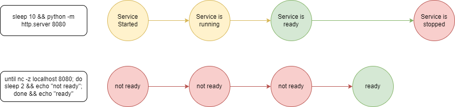

<!--startTocHeader-->
[🏠](../../README.md) > [🧠 Core Concepts](../README.md) > [🔨 Task](README.md)
# 🍹 Long Running Service
<!--endTocHeader-->

A long running service might run indefinitely until it is killed. Web servers and database servers are example of long running services.

__Example:__

Let's try running a static web service by invoking `python -m http.server 8080`.

```bash
python -m http.server 8080
```

<details>
<summary>Output</summary>

```````
Serving HTTP on 0.0.0.0 port 8080 (http://0.0.0.0:8080/) ...
```````
</details>

Thee http server will wait for any incoming request and giving appropriate response. This http server will keep on running until you turn it off (i,e., by pressing ctrl + C).


# Process Readiness

You can make sure a service is ready by giving it a request and observe its response. In our case, you can verify that the service is ready by openning a browser and visit `http://localhost:8080`.

Making sure that a service is ready can be tricky since `running` doesn't mean `ready`.

Orchestration tool like [kubernetes](https://kubernetes.io/) overcomes this problem by sending `liveness` and `readiness` [probes](https://kubernetes.io/docs/tasks/configure-pod-container/configure-liveness-readiness-startup-probes/).


# Start Process with Readiness Checker

Let's try to run a readiness checker for our http server.

First of all, you need to spawn two terminals in the same computer. You can also use [tmux](https://github.com/tmux/tmux)/[screen](https://linuxhint.com/screen-linux/) if you are familiar with any of those tools.

## Starter

In your first terminal, you can spawn a service starter:

```bash
sleep 10 && python -m http.server 8080
```
<details>
<summary>Output</summary>

````
Serving HTTP on 0.0.0.0 port 8080 (http://0.0.0.0:8080/) ...
````
</details>

This command asks the computer to wait for 10 seconds before starting the web server. We use this to emulate real world cases. Some server might even take more than a minute to be ready. Also, those 10 seconds give you enough time to open the second terminal and invoke the the checker.

## Checker

In your second terminal, you can spawn a loop to check service readiness:

```bash
until nc -z localhost 8080; do sleep 2 && echo "not ready"; done && echo "ready"
```
<details>
<summary>Output</summary>

````
not ready
not ready
not ready
not ready
ready
````
</details>

Great, now you can make sure that your service is really `ready` before deal with it any further.

> 💡 __TIPS:__  Feel free to run the `checker` first before running the `starter`. 

To see how our starter and checker works, let's take a look on this diagram:




# Starting Long Running Service with Zaruba

Unless you are a [starcraft](https://starcraft2.com/en-us/) pro player, manage many terminals at once is not a good idea. [Multitasking is bad for your brain](https://fee.org/articles/multitasking-is-bad-for-your-brain/).

To run many tasks in parallel, you can use [PM2](https://pm2.keymetrics.io/), [docker-compose](https://docs.docker.com/compose/), or Zaruba.

Running services with Zaruba gives you some advantages. Especially during development phase:

* You can run many services in parallel (i,e., `zaruba please task-1 task-2... task-n`).
* You can use re-use your service by [extending](./extend-task.md) it.
* You can define some [pre-requisites](./define-task-dependencies.md) for your service.
* If you run many services in parallel, you can see their logs in real time.

In the next two sections, you will learn how to run a long-running process with Zaruba.

## Lower Level Approach

First you declare this script in your `index.zaruba.yaml`

```yaml
tasks:

  startServer:
    start: [bash, -c, 'sleep 10 && python -m http.server 8080']
    check: [bash, -c, 'until nc -z localhost 8080; do sleep 2 && echo "not ready"; done && echo "ready"']
```

then, you can invoke `zaruba please startServer`.


__Example:__

<!--startCode-->
```bash
cd examples/core-concepts/task/long-running-service/low-level
zaruba please startServer -t -w 1s
```
 
<details>
<summary>Output</summary>
 
```````
💀 🔎 Job Starting...
         Elapsed Time: 1.824µs
         Current Time: 05:56:45
💀 🏁 Running 🍏 startServer starter (Attempt 1 of 3) on /home/gofrendi/zaruba/docs/examples/core-concepts/task/long-running-service/low-level
💀 🏁 Running 🍏 startServer readiness checker (Attempt 1 of infinite) on /home/gofrendi/zaruba/docs/examples/core-concepts/task/long-running-service/low-level
💀 🔥 Exit 🍏 startServer readiness checker (Attempt 1 of infinite):
        * bash
        * -c
        * nc -z localhost 8080
exit status 1
💀 🏁 Running 🍏 startServer readiness checker (Attempt 2 of infinite) on /home/gofrendi/zaruba/docs/examples/core-concepts/task/long-running-service/low-level
💀 🔥 Exit 🍏 startServer readiness checker (Attempt 2 of infinite):
        * bash
        * -c
        * nc -z localhost 8080
exit status 1
💀 🏁 Running 🍏 startServer readiness checker (Attempt 3 of infinite) on /home/gofrendi/zaruba/docs/examples/core-concepts/task/long-running-service/low-level
💀 🔥 Exit 🍏 startServer readiness checker (Attempt 3 of infinite):
        * bash
        * -c
        * nc -z localhost 8080
exit status 1
💀    🚀 startServer          🍏 Serving HTTP on 0.0.0.0 port 8080 (http://0.0.0.0:8080/) ...
💀 🏁 Running 🍏 startServer readiness checker (Attempt 4 of infinite) on /home/gofrendi/zaruba/docs/examples/core-concepts/task/long-running-service/low-level
💀 🎉 Successfully running 🍏 startServer readiness checker (Attempt 4 of infinite)
💀 🔎 Job Running...
         Elapsed Time: 6.01070632s
         Current Time: 05:56:51
         Active Process:
           * (PID=1244) 🍏 startServer starter (Attempt 1 of 3)
💀 🎉 🎉🎉🎉🎉🎉🎉🎉🎉🎉🎉🎉
💀 🎉 Job Complete!!! 🎉🎉🎉
💀 🔥 Terminating
💀 🔪 Kill 🍏 startServer starter (PID=1244)
💀    🚀 startServer          🍏 
💀    🚀 startServer          🍏 Keyboard interrupt received, exiting.
💀 🎉 Successfully running 🍏 startServer starter (Attempt 1 of 3)
💀 🔎 Job Ended...
         Elapsed Time: 8.217224888s
         Current Time: 05:56:53
💀 🔥 🍏 startServer starter exited without any error message
zaruba please startServer   -t -w 1s
```````
</details>
<!--endCode-->


Good. This is what `check` property is for. It tells Zaruba how to check your service readiness. 

In Zaruba, any task with `start` and `check` properties are treated as `long running service`.

Some task might have `check` property eventhough it is not explicitly written. This is especially true if you [extend/inherit](extend-task.md) your task from another task.
    
> 💡 __TIPS:__  You might wonder why the server log doesn't show up unless you terminate it with `ctrl + c`. This is happened because of python buffering mechanism. To turn off this feature, you can set `PYTHONUNBUFFERED` to `1`. (i,e., by using this as start command, `start: [bash, -c, 'sleep 10 && export PYTHONUNBUFFERED=1 && python -m http.server 8080']`)


## Higher Level Approach

The previous approach works well. But in most cases, you will likely see this instead:

```yaml
tasks:

  startServer:
    extend: zrbStartApp
    configs:
      start: sleep 10 && python -m http.server 8080
      ports: 8080
```

Let's try to change your `index.zaruba.yaml` and invoke `zaruba please startServer`.

__Example:__

<!--startCode-->
```bash
cd examples/core-concepts/task/long-running-service/high-level
zaruba please startServer -t -w 1s
```
 
<details>
<summary>Output</summary>
 
```````
💀 🔎 Job Starting...
         Elapsed Time: 1.96µs
         Current Time: 05:56:53
💀 🏁 Running 🔗 updateProjectLinks runner (Attempt 1 of 3) on /home/gofrendi/zaruba/docs/examples/core-concepts/task/long-running-service/high-level
💀    🚀 updateProjectLinks   🔗 🎉🎉🎉
💀    🚀 updateProjectLinks   🔗 Links updated
💀 🎉 Successfully running 🔗 updateProjectLinks runner (Attempt 1 of 3)
💀 🏁 Running 🍏 startServer starter (Attempt 1 of 3) on /home/gofrendi/zaruba/docs/examples/core-concepts/task/long-running-service/high-level
💀 🏁 Running 🍏 startServer readiness checker (Attempt 1 of infinite) on /home/gofrendi/zaruba/docs/examples/core-concepts/task/long-running-service/high-level
💀    🔎 startServer          🍏 🔎 Waiting for port '8080'
💀    🚀 startServer          🍏 Serving HTTP on 0.0.0.0 port 8080 (http://0.0.0.0:8080/) ...
💀 🎉 Successfully running 🍏 startServer readiness checker (Attempt 1 of infinite)
💀    🔎 startServer          🍏 🔎 Port '8080' is ready
💀    🔎 startServer          🍏 🎉🎉🎉
💀    🔎 startServer          🍏 📜 Task 'startServer' is ready
💀 🔎 Job Running...
         Elapsed Time: 11.050631415s
         Current Time: 05:57:04
         Active Process:
           * (PID=1289) 🍏 startServer starter (Attempt 1 of 3)
💀 🎉 🎉🎉🎉🎉🎉🎉🎉🎉🎉🎉🎉
💀 🎉 Job Complete!!! 🎉🎉🎉
💀 🔥 Terminating
💀 🔪 Kill 🍏 startServer starter (PID=1289)
💀    🚀 startServer          🍏 
💀    🚀 startServer          🍏 Keyboard interrupt received, exiting.
💀    🚀 startServer          🍏 🎉🎉🎉
💀    🚀 startServer          🍏 📜 Task 'startServer' is started
💀 🎉 Successfully running 🍏 startServer starter (Attempt 1 of 3)
💀 🔎 Job Ended...
         Elapsed Time: 13.258082685s
         Current Time: 05:57:07
💀 🔥 🍏 startServer starter exited without any error message
zaruba please startServer   -t -w 1s
```````
</details>
<!--endCode-->


This code is easier to write since you no longer need to write the checker's loop.

You might also notice that in this example, we don't have any `start` and `check` property. Instead, we have [extend](./extend-task.md) and [configs](./task-configs/README.md) property.

Here are some of the tasks you can extend when you want to start long running service:

* [zrbStartApp](../../core-tasks/zrb-start-app.md): Lowest level, general use case
* [zrbStartDockerContainer](../../core-tasks/zrb-start-docker-container.md): Start a docker container
* [zrbStartDockerCompose](../../core-tasks/zrb-start-docker-compose.md): Start a docker container

<!--startTocSubTopic-->
<!--endTocSubTopic-->
