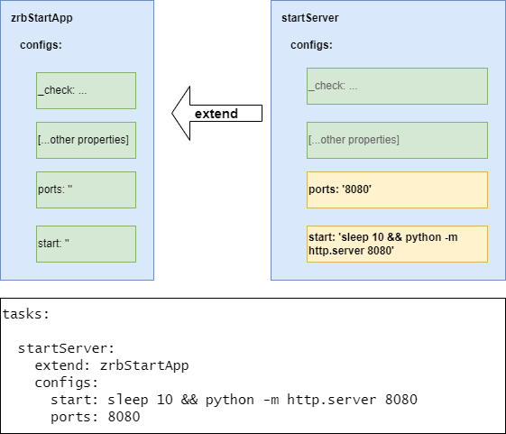

<!--startTocHeader-->
[🏠](../../README.md) > [🧠 Core Concepts](../README.md) > [🔨 Task](README.md)
# 🧒 Extend task
<!--endTocHeader-->


Let's say you and your friend went to buy ice creams. Your friend say something like this:

```
I want an ice cream with 3 different topping: vanilla, chocolate, and strawberry. Please also put a cherry on top of it.
```

You notice that you want something similar, but you don't want the cherry. So you say something like this:

```
I want something similar, but without the cherry.
```

That was smart. You don't need to describe your requirement from scratch. Instead, you `reuse` what your frien has said.

In object oriented programming, this kind of approach is formally known as `inherritance`.

Let's revisit our previous example:

```yaml
tasks:

  startServer:
    extend: zrbStartApp
    configs:
      start: sleep 10 && python -m http.server 8080
      ports: 8080
```

That's exactly what it looks like. `startServer` inherit properties from `zrbStartApp` and override some of them.


Now let's see the definition of [zrbStartApp](../../core-tasks/zrb-start-app.md):

```yaml
tasks:

  zrbStartApp:
    icon: 📜
    description: |
      ...
    private: true
    extend: zrbRunShellScript
    dependencies:
      - updateProjectLinks
    autoTerminate: false
    configRef: zrbStartApp
    start:
      - '{{ .GetConfig "cmd" }}'
      - '{{ .GetConfig "cmdArg" }}'
      - |
        {{ if .Util.Bool.IsFalse (.GetConfig "runInLocal") -}}
          echo 🎉🎉🎉
          echo "📜 ${_BOLD}${_YELLOW}Task '{{ .Name }}' is started${_NORMAL}"
          sleep infinity
        {{ end -}}
        {{ .Util.Str.Trim (.GetConfig "_setup") "\n " }}
        {{ .Util.Str.Trim (.GetConfig "setup") "\n " }}
        {{ .Util.Str.Trim (.GetConfig "beforeStart") "\n " }}
        {{ .Util.Str.Trim (.GetConfig "_start") "\n " }}
        {{ .Util.Str.Trim (.GetConfig "start") "\n " }}
        {{ .Util.Str.Trim (.GetConfig "afterStart") "\n " }}
        {{ .Util.Str.Trim (.GetConfig "finish") "\n " }}
        {{ .Util.Str.Trim (.GetConfig "_finish") "\n " }}
        echo 🎉🎉🎉
        echo "📜 ${_BOLD}${_YELLOW}Task '{{ .Name }}' is started${_NORMAL}"
    check:
      - '{{ .GetConfig "cmd" }}'
      - '{{ .GetConfig "cmdArg" }}'
      - |
        {{ if .Util.Bool.IsFalse (.GetConfig "runInLocal") -}}
          echo 🎉🎉🎉
          echo "📜 ${_BOLD}${_YELLOW}Task '{{ .Name }}' is ready${_NORMAL}"
          exit 0
        {{ end -}}
        {{ .Util.Str.Trim (.GetConfig "_setup") "\n " }}
        {{ .Util.Str.Trim (.GetConfig "setup") "\n " }}
        {{ .Util.Str.Trim (.GetConfig "beforeCheck") "\n " }}
        {{ .Util.Str.Trim (.GetConfig "_check") "\n " }}
        {{ .Util.Str.Trim (.GetConfig "check") "\n " }}
        {{ .Util.Str.Trim (.GetConfig "afterCheck") "\n " }}
        {{ .Util.Str.Trim (.GetConfig "finish") "\n " }}
        {{ .Util.Str.Trim (.GetConfig "_finish") "\n " }}
        echo 🎉🎉🎉
        echo "📜 ${_BOLD}${_YELLOW}Task '{{ .Name }}' is ready${_NORMAL}"
```

That's pretty long, and you might find this a bit overwhelming. There are some [go template](../use-go-template.md) that you can chek on. But here is how things work in a nutshell:



Let's focus on several key points:

* `zrbStartApp` has `start` and `check` properties.
* Since `startServer` is extended from `zrbStartApp`, it also has the same properties as well (i,e., `start`, and `check`).
* Furthermore, `startServer` define its own `start` and `check` config. When Zaruba execute `startServer`, it will use this configuration instead of `zrbStartApp`'s.
* Finally, please take note that you don't need to write `zrbStartApp` since it is already declared as `preloaded script`. You just need to know how to extend it and preferably know how it works.

<!--startTocSubtopic-->

<!--endTocSubtopic-->