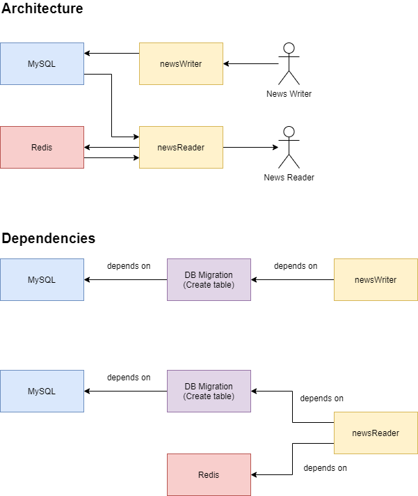

# Working with Legacy Code

Suppose you have two services:

* `newsWriter`: to add news into the database
* `newsReader`: to read news from the cache/database



Those two services were written in Node.Js and have the same code base:

```js
const express = require('express');
const mysql = require('mysql2');
const redis = require('redis');
const app = express();
app.use(express.json());

const mysqlConn = mysql.createConnection({
    host: process.env.MYSQL_HOST || 'localhost',
    user: process.env.MYSQL_USER || 'root',
    password: process.env.MYSQL_PASS || '',
    database: process.env.MYSQL_DB || 'news',
});
mysqlConn.connect(); // Note: just for demo. Better to not init the connection here.

const mode = process.env.MODE || 'reader';

if (mode == 'reader') {
    console.log('READER');
    const redisConn = redis.createClient({
        host: process.env.REDIS_HOST || 'localhost',
        port: process.env.REDIS_PORT || 6379,
    });
    app.get('/', (req, res) => {
        redisConn.get('articles', (err, redisResult) => {
            console.log('get article request');
            console.log('get article from redis');
            if (err || !redisResult) { 
                // cannot get article from redis, get from mysql instead
                console.log('get article from mysql');
                return mysqlConn.query('SELECT * from articles', (error, mysqlResults, fields) => {
                    if (error) throw error;
                    redisConn.set('articles', JSON.stringify(mysqlResults), 'ex', 300); // save the results into redis
                    res.send(mysqlResults); // return the result
                });
            }
            // here is the article
            res.send(JSON.parse(redisResult));
        })
    });
}

if (mode == 'writer') {
    console.log('WRITER');
    app.post('/', (req, res) => {
        console.log('post article request');
        return mysqlConn.query(`INSERT INTO articles(title, content) VALUES('${req.body.title}', '${req.body.content}');`, (error) => {
            if (error) throw error;
            res.send('Article added');
        });
    });
}

const port = process.env.PORT || 3000;
app.listen(port);
```