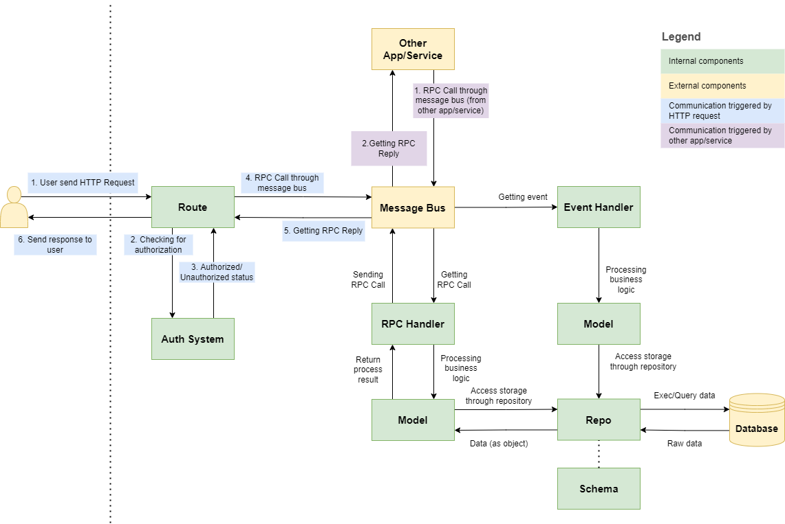

# ZtplAppDirectory

An opinionated Fast API application.

# How to run

```bash
# create virtual environment if not exist
if [ ! -d ./venv ]; then python -m venv ./venv; fi

# activate virtual environment
source venv/bin/activate

# install pip packages
pip install -r requirements.txt

# load environments
source template.env

# run the application
./start.sh
```

# Application directory structure

```
.
├── Dockerfile
├── README.md
├── 🔑 auth                      # Authentication + Authorization module
│   ├── __init__.py
│   ├── event.py                  # Auth's event handler
│   ├── route.py
│   ├── rpc.py
│   ├── authService.py              # Auth service
│   ├── roleService.py
│   ├── roleRoute.py
│   ├── roleRpc.py
│   ├── tokenService.py
│   ├── userService.py
│   ├── userRoute.py
│   ├── userRpc.py
│   └── userSeederService.py
├── database.db
├── 🧰 helpers
│   ├── __init__.py
│   ├── app                       # App configuration halpers
│   └── transport                 # Messagebus and RPC helpers
├── <⚙️ module>                  # Module (domain)
│   ├── __init__.py
│   ├── event.py                  # Module's event handler
│   ├── route.py                  # Module's route handler
│   ├── rpc.py                    # Module's rpd handler
│   ├── <⚙️ crud-service>.py       # CRUD service (business logic layer)
│   ├── <⚙️ crud-route>.py       # CRUD route (delivery layer)
│   └── <⚙️ crud-rpc>.py         # CRUD RPC layer (connecting route and service)
├── main.py                       # App bootstrap (components initialization and interaction)
├── 🛢️ repos
│   ├── __init__.py
│   ├── <⚙️ crud-repo>.py        # CRUD repo interface (datastore layer)
│   ├── <⚙️ db-crud-repo>.py     # CRUD repo implementation (datastore layer)
│   ├── dbRole.py
│   ├── dbUser.py
│   ├── role.py
│   └── user.py
├── requirements.txt
├── 📋 schemas
│   ├── __init__.py
│   ├── <⚙️ crud-schema>.py      # Data structure (DTO)
│   ├── role.py
│   └── user.py
├── start.sh
└── template.env
```

# Dependency injection

In software engineering, it is common to use [dependency injection](https://en.wikipedia.org/wiki/Dependency_injection). Dependency injection helps you to reduce coupling between classes/functions and their dependencies.

There are two types of dependency injection in this app:

## Simple mechanism

You have used simple injections all the time.

This mechanism is verbose, simple, and very readable. Thus, you should use it whenever possible.

Let's see how this mechanism works:

```python
db_url = os.getenv('APP_SQLALCHEMY_DATABASE_URL', 'sqlite:///database.db')

# to create an engine, you need a db_url
engine = create_engine(db_url, echo=True)

# to create book repo, you need an engine
book_repo = DBBookRepo(engine=engine, create_all=True)

# to register rpc handlers, you need rpc object and book repo
register_library_rpc_handler(rpc, book_repo)
```

Very simple and straightforward:

* First, you need `db_url` to create the `engine`.
* You also need the `engine` to create the `book_repo`.
* Finally, you need `rpc` and `book_repo` to call `register_library_rpc_handler`.

You can see this pattern in [`main.py`](./main.py)

## FastAPI mechanism

FastAPI has its own [dependency injection](https://fastapi.tiangolo.com/tutorial/dependencies/) mechanism.

For example, you need `OAuth2PasswordRequestForm` in your `login` handler.

Since `OAuth2PasswordRequestForm` is `Callable`, you can expect it to return something. The `login` function takes the `OAuth2PasswordRequestForm` return value as its `form_data` argument:

```python
@app.post(access_token_url, response_model=TokenResponse)
async def login(form_data: OAuth2PasswordRequestForm = Depends()):
    try:
        access_token = rpc.call('get_user_token', form_data.username, form_data.password)
        return TokenResponse(access_token = access_token, token_type = 'bearer')
    except:
        print(traceback.format_exc()) 
        raise HTTPException(status_code=400, detail='Incorrect identity or password')
```

# Components interaction

There are several components available in the ztplAppDirectory application. We will dive into each component in this section.



## Route handlers

Route handlers handle HTTP requests from users/other apps. 

First, It needs to talk to `Auth system` to authenticate/authorize the request.

Once the auth system check the request, the route handler will do some pre-processing and fire an `event` or call a `RPC`.

See these examples:

```python

def register_ml_route_handler(app: FastAPI, mb: MessageBus, rpc: RPC, auth_service: AuthService):

    @app.get('/train-service', response_class=HTMLResponse)
    def train_service(current_user: User = Depends(auth_service.everyone()), config: Mapping[str, Any]) -> HTMLResponse:
        # invoking trainService
        mb.publish('trainService', config)
        # immediately return response without waiting for train_service event to be processed.
        return HTMLResponse(content='train process has been invoked', status_code=200)

    @app.get('/predict-data', response_class=float)
    def predict_data(current_user: User = Depends(auth_service.everyone()), data: List[float]) -> HTMLResponse:
        # have to get the prediction result before returning response.
        prediction = rpc.call('predictData', data)
        return prediction

    print('Register ml route handler')
```

Let's take a deeper look.

Everyone can access `/train-service` and `/predict-data`. It is expected, since we use `auth_service.everyone()` in those routes.

The `/train-service` route handler sends an event through `mb.publish` and immediately send HTTP response. This is make sense since ML service training might need minutes, hours, or even days. The best information we can give to user is that the train process has been invoked. We might need to have another handler to receive to event, do the training process, and send email to user to inform that the process has been completed.

The `/predict-data` route handler sends RPC (remote procedure call) through `rpc.call`. Unlike event, RPC is expected to return the result. It is make sense, because whenever you predict data using a machine learning service, you expect the result as the response. We assume that the prediction process usually doesn't take long. Not as long as training, and it is make sense for user to wait the response.

>💡 __Note:__ We have local RPC/messagebus as well, so you don't really need to install third party message bus unless necessary.

## Auth system

FastAPI provide a very good [tutorial](https://fastapi.tiangolo.com/tutorial/security/) about security and authentication. You might want to visit it in order to get a better understanding about how authentication works.

Auth system responsible for two things:

* Authenticate who you are
* Authorize you to access application's features.

As for this writing, our auth system doesn't handle security from message bus (i,e., RPC/Event).

The most important part of the auth system is the auth service.

```python
class AuthService(abc.ABC):

    @abc.abstractmethod
    def everyone(self) -> Callable[[Request], User]:
        pass

    @abc.abstractmethod
    def is_authenticated(self) -> Callable[[Request], User]:
        pass

    @abc.abstractmethod
    def is_authorized(self, *permissions: str) -> Callable[[Request], User]:
        pass
```

The auth service has an interface (or abstract base class) containing several methods you can use on your route. The methods are returning `current user` if the user is authorized. The detail of each method are depending on its implementation, but the general consensus is:

* `everyone`: Everyone should be able to access the resource. If the user has been logged in, this method should return the logged-in user. Otherwise, it should return guest user. This method should never throw an error.
* `is_authenticated`: Only authenticated user (i,e., has been logged in) can access the resource. This method should return the logged in user or throwing an error.
* `is_authorized`. Only user with any of the permissions defined in the parameter can access the resource. This method should return the authorized user or throwing an error.

There are two implementation of the auth service:

* `NoAuthService`: No authentication at all, basically will allow everyone to access the resources.
* `TokenOAuth2AuthService`: OAuth2 authentication with JWT Token. It will check user's permission/roles.

If you are using `TokenOAuth2AuthService`, there is a special permission that grant user all access. You can set the permission through `APP_ROOT_PERMISSION` environment.

There are several environment related to the Auth System:

```bash
# default root user name. If the user name deosn't exist, it will be auto-crated
APP_ROOT_USERNAME="root"

# initial root email, can be used for log in, along with username or phone number
APP_ROOT_INITIAL_EMAIL="root@innistrad.com"

# initial root phone number, can be used for log in, alog with username or email
APP_ROOT_INITIAL_PHONE_NUMBER="+621234567890"

# initial password for your root account. Change this !!!
APP_ROOT_INITIAL_PASSWORD="Alch3mist"

# special permission to grant user all access if TokenOAuth2AuthService is used
APP_ROOT_PERMISSION="root"

# initial full name for root
APP_ROOT_INITIAL_FULL_NAME="root"

# guest user name
APP_GUEST_USERNAME="guest"

# secret to encode JWT. Change this!!!
APP_ACCESS_TOKEN_SECRET_KEY = "09d25e094faa6ca2556c818166b7a9563b93f7099f6f0f4caa6cf63b88e8d3e7"

# algorithm to encode JWT
APP_ACCESS_TOKEN_ALGORITHM = "HS256"

# JWT token's expiration time
APP_ACCESS_TOKEN_EXPIRE_MINUTES = 30

# URL to generate JWT Token based on user's identity
APP_ACCESS_TOKEN_URL=/api/v1/token/
```

## Event handlers

To handle an event, you should use `mb.handle` decorator and apply it to an `event handler`.

An `event handler` is a function that receive an input parameter. Notice that the parameter should be a `dictionary` containing no python objects, functions, or classes. The parameter is designed to receive data from over the wire that can even be generated by other programming language.

```python
def register_ml_event_handler(mb: MessageBus):

    @mb.handle('trainService')
    def handle_train_service(config: Mapping[str, Any]):
        # doing training
        # send email to service's owner
        print('handle train_service event with config: {}'.format(config))
```

>💡 __Note:__ you can use local event handler first, then swittch to kafka/rabbitmq when it is necessary

## RPC handlers

To handle a RPC, you should use `rpc.handle` decorator and apply it to an `rpc handler`.

A `RPC handler` is a function receiving any number of primitive values, dictionary, or list. The values shoulw not contains no python object, function, or class. The function is expected to return any value.

```python
def register_ml_rpc_handler(rpc: RPC):

    @rpc.handle('predictData')
    def is_book_available(data: List[float]) -> str:
        print('handle RPC call predictData with parameter: {}'.format(data))
        result = 'label'
        return result
```

>💡 __Note:__ you can use local rpc handler, then swittch to rabbitmq when it is necessary.

## Service

Service should contains business logics. Typically to initiate a service, you will need a `repo` or several `repos`.

The reason behind this architecture is because we want to be able to swap our storages easily. For example, you are already using MySQL/postgre as storage, but you then realize some things are better to be stored in No-SQL. In this case, you don't need to touch the service since there is no business logic being changed here. You just need to create a new repo that talk to your new storage and inject it to the service.

Here is an example of book CRUD:

```python
from typing import Any, List, Mapping
from schemas.book import Book, BookData
from repos.book import BookRepo

class BookService():

    def __init__(self, book_repo: BookRepo):
        self.book_repo = book_repo

    def find(self, keyword: str, limit: int, offset: int) -> List[Book]:
        return self.book_repo.find(keyword, limit, offset)

    def find_by_id(self, id: str) -> Book:
        return self.book_repo.find_by_id(id)

    def insert(self, book_data: BookData) -> Book:
        return self.book_repo.insert(book_data)

    def update(self, id: str, book_data: BookData) -> Book:
        return self.book_repo.update(id, book_data)

    def delete(self, id: str) -> Book:
        return self.book_repo.delete(id)
```

The service can be used and call everywhere, but typically it is called from inside an `event handler` or `RPC handler`.

Auth service can be called from all the route since it is initialized in `main.py` and injected to every `route handler`. This is necessary because we want to validate our routes with auth service.

## Schema

Schema defines how your data is going to be structured and managed in your code. Typically schemas are located at `schemas` directory.

Here is an example of book schema:

```python
from pydantic import BaseModel
import datetime

class BookData(BaseModel):
    title: str
    author: str
    synopsis: str
    pass


class Book(BookData):
    id: str
    created_at: datetime.datetime
    updated_at: datetime.datetime
    class Config:
        orm_mode = True
```

As you notice, there are two classes here. The first one represents your DTO, while the second one represents how it is being saved in your storage. We need `orm_mode` because we want to easily translate the object into dictionary or sql alchemy service and vice versa.

You can also embed some methods to your schema when you think it is necessary. For example, a `user` schema has `has_permission` and several other method to help us manipulate user's roles/permissions:

```python
from typing import Optional, List, TypeVar
from pydantic import BaseModel
import datetime, re

class UserData(BaseModel):
    username: str = ''
    email: str = ''
    phone_number: str = ''
    permissions: List[str] = []
    role_ids: List[str] = []
    active: bool = False
    password: Optional[str] = ''
    full_name: str = ''

    def has_permission(self, permission: str) -> bool:
        for existing_permission in self.permissions:
            existing_permission_pattern = re.sub('\*', '[0-9a-zA-Z]+', existing_permission)
            if re.search('^{}$'.format(existing_permission_pattern), permission):
                return True
        return False

    def add_permission(self, permission: str):
        for existing_permission in self.permissions:
            if permission == existing_permission:
                return
        self.permissions.append(permission)

    def remove_permission(self, permission: str):
        new_permissions = [existing_permission for existing_permission in self.permissions if existing_permission != permission]
        self.permissions = ' '.join(new_permissions)

    def add_role_id(self, role_id: str):
        for existing_role_id in self.role_ids:
            if role_id == existing_role_id:
                return
        self.role_ids.append(role_id)

    def remove_role_id(self, role_id: str):
        new_role_ids = [existing_role_id for existing_role_id in self.role_ids if existing_role_id != role_id]
        self.role_ids = ' '.join(new_role_ids)


class User(UserData):
    id: str
    created_at: datetime.datetime
    updated_at: datetime.datetime
    class Config:
        orm_mode = True
```

## Repo

Repo is about storage. You can find repos on `repos` directory. Book repository for example, has this interface:

```python
from typing import List
from schemas.book import Book, BookData

import abc

class BookRepo(abc.ABC):

    @abc.abstractmethod
    def find_by_id(self, id: str) -> Book:
        pass

    @abc.abstractmethod
    def find(self, keyword: str, limit: int, offset: int) -> List[Book]:
        pass

    @abc.abstractmethod
    def insert(self, book_data: BookData) -> Book:
        pass

    @abc.abstractmethod
    def update(self, id: str, book_data: BookData) -> Book:
        pass

    @abc.abstractmethod
    def delete(self, id: str) -> Book:
        pass
```

The implementation is up to the developer, but typical implementation for sql alchemy looks like this:

```python
from typing import List
from sqlalchemy.ext.declarative import declarative_base
from sqlalchemy.engine import Engine
from sqlalchemy.orm import Session
from sqlalchemy import Boolean, Column, DateTime, ForeignKey, Integer, String
from schemas.book import Book, BookData
from repos.book import BookRepo

import uuid
import datetime

Base = declarative_base()

class DBBookEntity(Base):
    __tablename__ = "books"
    id = Column(String(36), primary_key=True, index=True)
    title = Column(String(20), index=True)
    author = Column(String(20), index=True)
    synopsis = Column(String(20), index=True)
    created_at = Column(DateTime, default=datetime.datetime.now)
    updated_at = Column(DateTime, default=datetime.datetime.now)


class DBBookRepo(BookRepo):

    def __init__(self, engine: Engine, create_all: bool):
        self.engine = engine
        if create_all:
            Base.metadata.create_all(bind=engine)

    def find_by_id(self, id: str) -> Book:
        db = Session(self.engine)
        result: Book
        try:
            db_result = db.query(DBBookEntity).filter(DBBookEntity.id == id).first()
            if db_result is None:
                return None
            result = Book.from_orm(db_result)
        finally:
            db.close()
        return result

    def find(self, keyword: str, limit: int, offset: int) -> List[Book]:
        db = Session(self.engine)
        results: List[Book] = []
        try:
            keyword = '%{}%'.format(keyword) if keyword != '' else '%'
            db_results = db.query(DBBookEntity).filter(DBBookEntity.title.like(keyword)).offset(offset).limit(limit).all()
            results = [Book.from_orm(db_result) for db_result in db_results]
        finally:
            db.close()
        return results

    def insert(self, book_data: BookData) -> Book:
        db = Session(self.engine)
        result: Book
        try:
            db_entity = DBBookEntity(
                id=str(uuid.uuid4()),
                title=book_data.title,
                author=book_data.author,
                synopsis=book_data.synopsis,
                created_at=datetime.datetime.now()
            )
            db.add(db_entity)
            db.commit()
            db.refresh(db_entity) 
            result = Book.from_orm(db_entity)
        finally:
            db.close()
        return result

    def update(self, id: str, book_data: BookData) -> Book:
        db = Session(self.engine)
        result: Book
        try:
            db_entity = db.query(DBBookEntity).filter(DBBookEntity.id == id).first()
            if db_entity is None:
                return None
            db_entity.title = book_data.title
            db_entity.author = book_data.author
            db_entity.synopsis = book_data.synopsis
            db_entity.updated_at = datetime.datetime.now()
            db.add(db_entity)
            db.commit()
            db.refresh(db_entity) 
            result = Book.from_orm(db_entity)
        finally:
            db.close()
        return result

    def delete(self, id: str) -> Book:
        db = Session(self.engine)
        result: Book
        try:
            db_entity = db.query(DBBookEntity).filter(DBBookEntity.id == id).first()
            if db_entity is None:
                return None
            db.delete(db_entity)
            db.commit()
            result = Book.from_orm(db_entity)
        finally:
            db.close()
        return result
```


# Event

To handle an event, you need a message bus object.

The message bus should have this interface:

```python
class MessageBus(abc.ABC):

    @abc.abstractmethod
    def handle(self, event_name: str) -> Callable[..., Any]:
        pass

    @abc.abstractmethod
    def publish(self, event_name: str, message: Any) -> Any:
        pass

    @abc.abstractmethod
    def shutdown(self) -> Any:
        pass
```

You can implement your own message bus implementation using this interface. Currently, there are several implementation of message bus.

## Local

Best for testing or stand alone app without external dependencies. Cannot be shared among application instance.

```python
from helpers.transport import LocalMessageBus
mb = LocalMessageBus()
```

## Rabbitmq

Rabbitmq implementation of the messagebus. Fit for most cases.

```python
from helpers.transport import RMQMessageBus, RMQEventMap, create_rmq_connection_parameters

rmq_connection_parameters = create_rmq_connection_parameters(
    host = os.getenv('APP_RABBITMQ_HOST', 'localhost'),
    user = os.getenv('APP_RABBITMQ_USER', 'root'),
    password = os.getenv('APP_RABBITMQ_PASS', ''),
    virtual_host = os.getenv('APP_RABBITMQ_VHOST', '/'),
    heartbeat=30
)
rmq_event_map = RMQEventMap({})

RMQMessageBus(rmq_connection_parameters, rmq_event_map)
```

## Kafka

```python
from helpers.transport import KafkaMessageBus, KafkaEventMap, create_kafka_connection_parameters

kafka_connection_parameters = create_kafka_connection_parameters(
    bootstrap_servers = os.getenv('APP_KAFKA_BOOTSTRAP_SERVERS', 'localhost:29092'),
    sasl_mechanism = os.getenv('APP_KAFKA_SASL_MECHANISM', 'PLAIN'),
    sasl_plain_username = os.getenv('APP_KAFKA_SASL_PLAIN_USERNAME', 'root'),
    sasl_plain_password = os.getenv('APP_KAFKA_SASL_PLAIN_PASSWORD', '')
)
kafka_event_map = KafkaEventMap({})

KafkaMessageBus(kafka_connection_parameters, kafka_event_map)
```

## Your custom message bus

As long as a class comply the interface, you can make your own implementation. Please let [us](https://twitter.com/zarubastalchmst) know if you do so and you want to contribute back.

# RPC

To handle RPC you need a RPC object.

The RPC object should have the following inteface:

```python
class RPC(abc.ABC):

    @abc.abstractmethod
    def handle(self, rpc_name: str) -> Callable[..., Any]:
        pass

    @abc.abstractmethod
    def call(self, rpc_name: str, *args: Any) -> Any:
        pass

    @abc.abstractmethod
    def shutdown(self) -> Any:
        pass
```

You can implement your own RPC implementation using this interface. Currently, there are several implementation of RPC implementation.

## Local

Best for testing or stand alone app without external dependencies. Cannot be shared among application instance.

```python
from helpers.transport import LocalRPC

rpc = LocalRPC()
```

## Rabbitmq

Rabbitmq implementation of the messagebus. Fit for most cases.

```python
from helpers.transport import RMQRPC, RMQEventMap, create_rmq_connection_parameters

rmq_connection_parameters = create_rmq_connection_parameters(
    host = os.getenv('APP_RABBITMQ_HOST', 'localhost'),
    user = os.getenv('APP_RABBITMQ_USER', 'root'),
    password = os.getenv('APP_RABBITMQ_PASS', ''),
    virtual_host = os.getenv('APP_RABBITMQ_VHOST', '/'),
    heartbeat=30
)
rmq_event_map = RMQEventMap({})

rpc = RMQRPC(rmq_connection_parameters, rmq_event_map)
```

## Your custom RPC

As long as a class complies with the interface, you can make your own implementation. Please let [us](https://twitter.com/zarubastalchmst) know if you do so and you want to contribute back.