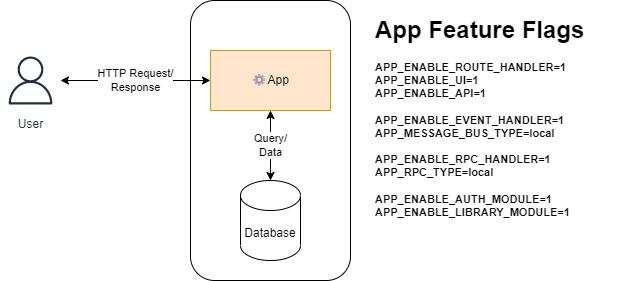
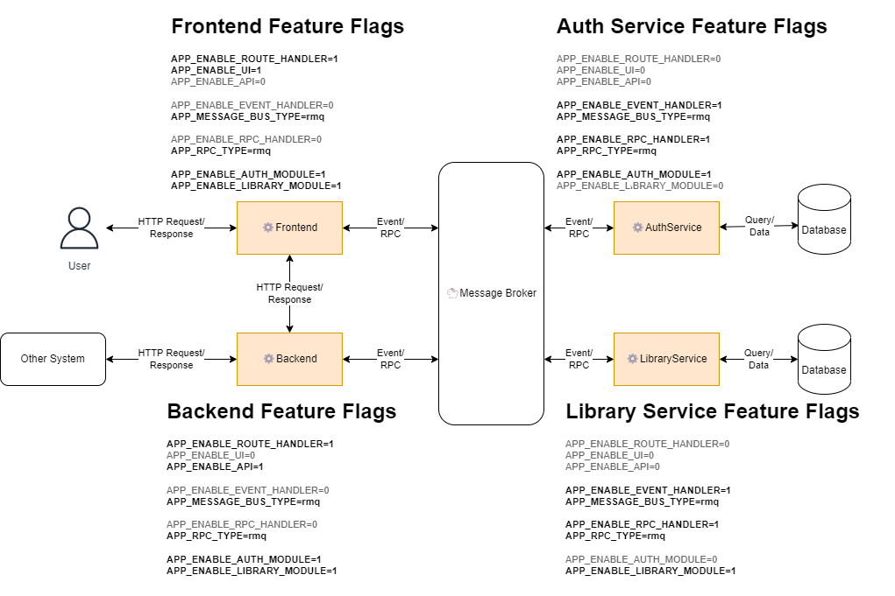

<!--startTocHeader-->
[🏠](../README.md)
# Motivation and architecture
<!--endTocHeader-->

# Microservices vs Monolith

In 2016, [DHH](https://twitter.com/dhh) wrote an article titled [Majestic Monolith](https://m.signalvnoise.com/the-majestic-monolith/).

Since big tech companies use microservices architecture, people start to get interested in this architecture. DHH argued that not all companies need microservices architecture.

Sometimes monolith is just right, but sometimes microservices-architecture is better.

Let's see how microservices and a monolith compared to each other.

## Microservices: The good and the bad


Microservices architecture is good because:

- It is easy to scale up/down particular services.
- Users can still access the system even though some services are down.
- Services can be developed/deployed independently from each other.

Microservices architecture is bad because:

- There is a lot of network communication.
- Either you build a correct one, or just create a distributed monolith.
- Deploying microservices can be challenging.

## Monolith: The good and the bad


Monolith architecture is good because:

- It is easy to run, debug, or deploy.

Monolith architecture is bad because:

- People tend to cross the domain boundary because they can.
- When it is down, the entire system is down.
- You cannot scale up/down only particular services.

## Microservices or monolith?

If you are just __getting started__, a __monolith architecture__ is probably your best option.

Once you need to __scale__ different aspects of your system differently, you can start with __microservices architecture__.

# Microservices-ready monolith

When businesses get bigger, tech departments usually suffer from any of these problems:

- Moving a working monolith into microservices
- Premature optimization/over-engineering:
    - You find that your current "microservices" architecture is a distributed monolith that:
        - Has all the drawbacks of microservices architecture.
        - Has all the drawbacks of monolith architecture.

We can make things better by creating a monolith application that can be deployed as microservices.

You can think of a microservices-ready monolith as a super-soldier than has gone through a lot of training. Alone, this super-soldier is already capable of a lot of things. He can shoot, fight, drive a helicopter, and even hack a satellite.

But when you do a bigger mission, you cannot just rely on a single super-soldier. You need a team of super-soldiers. You need to assign different tasks for every member so that they can achieve a bigger goal.


## Microservices-ready monolith: The good and the bad

Microservices-ready monolith is good because:

- It can be deployed and executed easily as a monolith.
- It has a single codebase.
- It can be deployed as microservices using [feature flags](feature-flags.md).
- Everyone is aware of code changes.

It is bad because:

- Everyone is aware of code changes (Code-level authorization is nearly impossible).
- People tend to cross the domain boundary because they can.

# Example

Suppose you have two modules in `ZtplAppDirectory`:

- Library
- Auth

Each module serves different domains, and someday you will need to scale them independently. But for now, let's start with a monolith:



You can configure `ZtplAppDirectory` using environment variables. For example, you can enable/disable the user interface by passing `0` or `1` to `APP_ENABLE_UI`.

When you run `ZtplAppDirectory` as a monolith, you need to enable every feature flag.

You should also use `local` message bus/RPC(remote procedure call) instead of RabbitMq or Kafka. Even though local message bus/RPC is not scalable, it is simple and reliable for a single application. You don't want to overcomplicate things in the beginning. Also, [network is not reliable](https://particular.net/blog/the-network-is-reliable).

All good, you can run everything locally.

## Into microservices

At some point, you need to scale your modules independently. You can achieve this without doing any change in `ZtplAppDirectory` codebase. What you need to do is just deploy multiple `ZtplAppDirectory` with different feature flags (configurations).



Let's take a look at every instance of `ZtplAppDirectory`:

### Frontend

Its purpose is to serve UI. It should not handle API requests, events, or RPC. But it should serve the UI of both `auth` and `library` modules.

```bash
# Only serve UI
APP_ENABLE_ROUTE_HANDLER=1
APP_ENABLE_ROUTE_UI=1

# Using rmq (Rabbitmq) as RPC/Messagebus platform
APP_MESSAGE_BUS_TYPE=rmq
APP_RPC_TYPE=rmq

# Enable auth and library modules
APP_ENABLE_AUTH_MODULE=1
APP_ENABLE_LIBRARY_MODULE=1
```

### Backend

Its purpose is to serve API requests from frontend apps and external systems (e.g., mobile apps). Thus, it should not serve UI or handle events/RPC.


```bash
# Only serve API
APP_ENABLE_ROUTE_HANDLER=1
APP_ENABLE_ROUTE_API=1

# Using rmq (Rabbitmq) as RPC/Messagebus platform
APP_MESSAGE_BUS_TYPE=rmq
APP_RPC_TYPE=rmq

# Enable auth and library modules
APP_ENABLE_AUTH_MODULE=1
APP_ENABLE_LIBRARY_MODULE=1
```

### Auth Service

Its purpose is to serve any RPC/event related to the authentication domain.

```bash
# Using rmq (Rabbitmq) as RPC/Messagebus platform, handle both RPC and events
APP_ENABLE_EVENT_HANDLER=1
APP_MESSAGE_BUS_TYPE=rmq
APP_ENABLE_RPC_HANDLER=1
APP_RPC_TYPE=rmq

# Enable auth module only
APP_ENABLE_AUTH_MODULE=1
```

### Library Service

Its purpose is to serve any RPC/event related to the library domain.


```bash
# Using rmq (Rabbitmq) as RPC/Messagebus platform, handle both RPC and events
APP_ENABLE_EVENT_HANDLER=1
APP_MESSAGE_BUS_TYPE=rmq
APP_ENABLE_RPC_HANDLER=1
APP_RPC_TYPE=rmq

# Enable library module only
APP_ENABLE_LIBRARY_MODULE=1
```

# Next

The idea of a microservices-ready monolith is only possible because of [feature flags](feature-flags.md) and [layered architecture](interface-and-layers.md). You can learn more about feature flags, interfaces, layers, and how to connect them in the sub-topics.

<!--startTocSubTopic-->
# Sub-topics
* [Feature flags](feature-flags.md)
* [Interface and layers](interface-and-layers.md)
* [Connecting layers](connecting-layers.md)
<!--endTocSubTopic-->