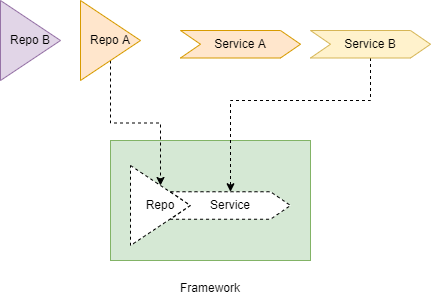

<!--startTocHeader-->
[🏠](../README.md) > [Motivation and architecture](README.md)
# Interface and layers
<!--endTocHeader-->

You can break down `ZtplAppDirectory` code into several layers.

A layer component can pass data into its top/botoom layer. However, every layer should be independent from each other.

# Interface



In `ZtplAppDirectory`, we use [Abstract Base Class](https://docs.python.org/3/library/abc.html) as interface.

Interface helps you to make your code more configurable. For example, as `Repo B` and `Repo A` comply `Repo` interface, you can use either `Repo B` or `Repo A` in your application.

This is why we are able to swap `LocalMessageBus` with `RMQMessageBus`, `KafkaAvroMessageBus`, or `KafkaMessageBus` easily.

You can see that all messagebus implementation comply `MessageBus` interface:

```python
class MessageBus(abc.ABC):

    @abc.abstractmethod
    def handle(self, event_name: str) -> Callable[..., Any]:
        pass

    @abc.abstractmethod
    def publish(self, event_name: str, message: Any) -> Any:
        pass

    @abc.abstractmethod
    def shutdown(self) -> Any:
        pass

    @abc.abstractclassmethod
    def get_error_count(self) -> int:
        pass

    @abc.abstractclassmethod
    def is_failing(self) -> bool:
        pass
```

This way, you will be able to create your own `messagebus` implementation as long as your implementation comply the interface.

# Available layers

We have several layers in `ZtplAppDirectory`


Layers are independent from each other, but they can pass data to each others. Some data are passed via function/method call, while some others require network communication (i.e., message bus, RPC, Database Query).

Let's see how each layers work:

## Route handler

This layer handle HTTP request from any client. It can return a HTML UI or an API response.
In most cases, route handler talk to RPC/event handler through message broker.

Route handler usually located on:

- `<module-name>/route.py`
- `<module-name>/<entity>/<entity>Route.py`

Here is an example of route handler layer:

```python
def register_book_entity_api_route(app: FastAPI, mb: MessageBus, rpc: RPC, auth_service: AuthService):

    @app.get('/api/v1/books/', response_model=BookResult)
    def find_books(keyword: str='', limit: int=100, offset: int=0, current_user: Optional[User] = Depends(auth_service.has_permission('api:book:read'))) -> BookResult:
        result = {}
        try:
            result = rpc.call('find_book', keyword, limit, offset)
        except:
            print(traceback.format_exc(), file=sys.stderr) 
            raise HTTPException(status_code=500, detail='Internal Server Error')
        return BookResult.parse_obj(result)
```

This route handler handle `GET /api/v1/books` request.

As for authorization, the URL can only be accessed by anyone who has `api:book:read` permission.

If the request is authorized, the route handler will pass the parameters into `find_book` RPC handler.

Please note that RPC handler and event handler only accept/return primitive data type, list, or dictionary. Thus, you need to call `BookResult.parse_obj(result)` to convert `result` into `BookResult` object.

## RPC handler

This layer handle RPC call from message broker. An RPC call usually expect a reply, so you have to make sure you give one.

RPC handler usually located on:

- `<module-name>/rpc.py`
- `<module-name>/<entity>/<entity>Rpc.py`

Example:

```python

def register_book_entity_rpc(rpc: RPC, book_repo: BookRepo):

    book_service = BookService(book_repo)

    @rpc.handle('find_book')
    def find_books(keyword: str, limit: int, offset: int) -> Mapping[str, Any]:
        book_result = book_service.find(keyword, limit, offset)
        return book_result.dict()
```

This handler handle `find_book` RPC call.

Once triggered, it will pass the parameters into repo layer (i.e., `book_service.find(keyword, limit, offset)`).

Since RPC handler expect to send/receive data over the network, it can only accept/return primitive data type, list or dictionary. Thus, it needs to render `book_result` into dictionary by invoking `book_result.dict()`.

## Event handler

This layer handle event from message broker. An event usually doesn't expect any reply/response.

Like RPC handler, event handler only accept primitive data type as well as list and dictionary.

RPC handler usually located on:

- `<module-name>/event.py`

Example:

```python

def register_library_event_handler(mb: MessageBus):

    @mb.handle('open')
    def handle_open(message: Mapping[str, Any]):
        print('Event ope has been occured with message: {}'.format(message))
```

## Service

This layer handle your business logic. It is usually triggered by `RPC handler` or `Event handler`.

When a service need to retrive something from/store something into database, it usually need to talk to `Repo` layer. For example:

```python

class BookService():

    def __init__(self, book_repo: BookRepo):
        self.book_repo = book_repo

    def find(self, keyword: str, limit: int, offset: int) -> BookResult:
        count = self.book_repo.count(keyword)
        rows = self.book_repo.find(keyword, limit, offset)
        return BookResult(count=count, rows=rows)
```


## Repo

This layer handle communication with database.

Repo layer usually located on:

- `<repos>/<entity>.py`
- `<repos>/db<Entity>.py`


Example:

```python

class DBBookRepo(BookRepo):

    def __init__(self, engine: Engine, create_all: bool):
        self.engine = engine
        if create_all:
            Base.metadata.create_all(bind=engine)

    def _get_keyword_filter(self, keyword: str) -> str:
        return '%{}%'.format(keyword) if keyword != '' else '%'

    def find(self, keyword: str, limit: int, offset: int) -> List[Book]:
        db = Session(self.engine, expire_on_commit=False)
        books: List[Book] = []
        try:
            keyword_filter = self._get_keyword_filter(keyword)
            db_books = db.query(DBBookEntity).filter(DBBookEntity.title.like(keyword_filter)).offset(offset).limit(limit).all()
            books = [Book.from_orm(db_result) for db_result in db_books]
        finally:
            db.close()
        return books

    def count(self, keyword: str) -> int:
        db = Session(self.engine, expire_on_commit=False)
        book_count = 0
        try:
            keyword_filter = self._get_keyword_filter(keyword)
            book_count = db.query(DBBookEntity).filter(DBBookEntity.title.like(keyword_filter)).count()
        finally:
            db.close()
        return book_count
```
# Connecting layers

Next, you can continue to [connecting components guide](connecting-components.md).

<!--startTocSubTopic-->
<!--endTocSubTopic-->