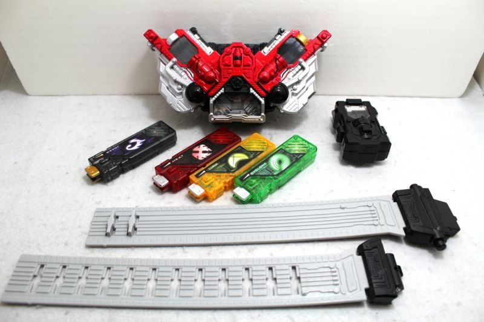
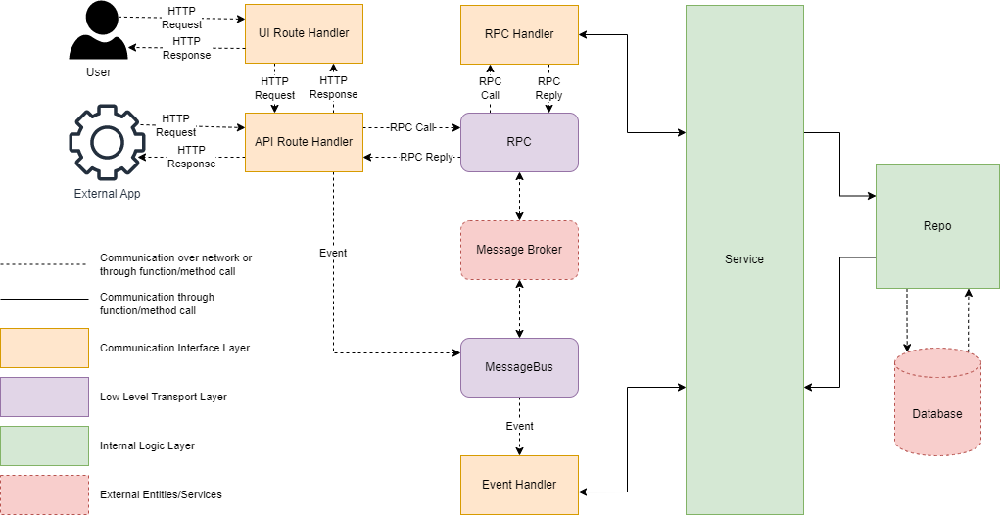

<!--startTocHeader-->
[🏠](../README.md) > [Motivation and architecture](README.md)
# Interface and layers
<!--endTocHeader-->

You can break down `ZtplAppDirectory` code into several layers.

Each layer component can talk to each other.

Some layer components has the same interface, so that they can replace each others. For example, both `LocalRPC` and `RMQRPC` are having the same interface: `RPC`. Thus, in your application, you can choose the RPC layer without changing any other implementation.

If you are into tokusatsu and kamen rider, you probably know about [Kamen rider W/double](https://www.youtube.com/watch?v=3uQdN5s4m6M). Unlike their previous predecessor, Kamen rider W/double has a belt that can combine different type of powers. By putting different gaia memories into their driver belt, they can use unique combination of powers to defeat their enemies.

<p align="center">
    
    <p align="center">Kamen rider W/double: DX driver belt and Gaia Memories</p>
</p>

You can see that all Gaia memories, despite of their different set of powers, has the same interface. Thus they can fit into the belt.

The following code will give you a better understanding about interface:

> Python doesn't really support interface, so we use [Abstract Base Class](https://docs.python.org/3/library/abc.html) instead.

```python
import abc

###################################################################################
# Gaia memories interface and implementations
###################################################################################

# Gaia memory interface.
# Every gaia memory instances should be able to `play_sound`
class GaiaMemory(abc.ABC):

    @abc.abstractmethod
    def play_sound(self):
        pass


# Joker gaia memory
class Joker(GaiaMemory):

    def play_sound(self):
        print('JOKA...')


# Cyclone gaia memory
class Cyclone(GaiaMemory):

    def play_sound(self):
        print('CYCLONE...')


# Trigger gaia memory
class Trigger(GaiaMemory):

    def play_sound(self):
        print('TORIGA...')

```

Now you can use `Joker`, `Cyclone`, and `Trigger` as `GaiaMemory`. As long as the implementations comply with the interface, the implementation can substitute each other. This is known as [Liskov substitution principle](https://en.wikipedia.org/wiki/Liskov_substitution_principle).

Let's continue with `WDriver` implementation. Notice that we will use `GaiaMemory` interface as `WDriver` constructor parameter. The code is as follows:


```python


###################################################################################
# W Belt driver implementation
###################################################################################

# W Belt Driver
class WDriver():

    def __init__(self, left_gaia_memory: GaiaMemory, right_gaia_memory: GaiaMemory):
        self.left_gaia_memory = left_gaia_memory
        self.right_gaia_memory = right_gaia_memory

    def henshin():
        self.left_gaia_memory.play_sound()
        self.right_gaia_memory.play_sound()
        print('さあ お前の罪を数えろ！') # now count up your sins
```

Finally, the program will looks like this:


```python

###################################################################################
# Let's henshin!!!
###################################################################################
cyclone = Cyclone()
jocker = Jocker()
belt = WDriver(cyclone, jocker)
belt.henshin() # CYCLONE... JOKA... さあ お前の罪を数えろ！
```

`ZtplAppDirectory` rely on this simple mechanism to achieve modularity and adaptability.

By default, `ZtplAppDirectory`, contains of several layers:

- `MessageBus`
- `RPC`
- `Repo`
- `Service`
- `API Route handler`
- `UI Route handler`
- `RPC handler`
- `Event handler`

By combining everything together, you get a working modular application.


# Available layers

To understand every layer component, we have to understand their domain/functions. The ultimate goal of those layers are __communication__ and __separation of concern__.

For example, when you think about the business process (Service layer) you don't need to bother how the data should be stored/fetched (Repo layer) or how the data should be served to user (UI/API route layer).

The business process should be agnostic about any other implementation.

<p align="center">
    
    <p align="center">Communication between layers</p>
</p>

Let's see the responsibility of each layers.

## Route handler

This layer handle HTTP request from any client. It can return a HTML UI or an API response.
In most cases, route handler talk to RPC/event handler through message broker.

Route handler usually located on:

- `<module-name>/route.py`
- `<module-name>/<entity>/<entity>_route.py`

Here is an example of route handler layer:

```python
def register_book_entity_api_route(app: FastAPI, mb: MessageBus, rpc: RPC, auth_service: AuthService):

    @app.get('/api/v1/books/', response_model=BookResult)
    def find_books(keyword: str='', limit: int=100, offset: int=0, current_user: Optional[User] = Depends(auth_service.has_permission('api:book:read'))) -> BookResult:
        result = {}
        try:
            result = rpc.call('find_book', keyword, limit, offset)
        except:
            print(traceback.format_exc(), file=sys.stderr) 
            raise HTTPException(status_code=500, detail='Internal Server Error')
        return BookResult.parse_obj(result)
```

This route handler handle `GET /api/v1/books` request.

As for authorization, the URL can only be accessed by anyone who has `api:book:read` permission.

If the request is authorized, the route handler will pass the parameters into `find_book` RPC handler.

Please note that RPC handler and event handler only accept/return primitive data type, list, or dictionary. Thus, you need to call `BookResult.parse_obj(result)` to convert `result` into `BookResult` object.

## RPC handler

This layer handle RPC call from message broker. An RPC call usually expect a reply, so you have to make sure you give one.

RPC handler usually located on:

- `<module-name>/rpc.py`
- `<module-name>/<entity>/<entity>_rpc.py`

Example:

```python

def register_book_entity_rpc(rpc: RPC, book_service: BookService):

    @rpc.handle('find_book')
    def find_books(keyword: str, limit: int, offset: int) -> Mapping[str, Any]:
        book_result = book_service.find(keyword, limit, offset)
        return book_result.dict()
```

This handler handle `find_book` RPC call.

Once triggered, it will pass the parameters into repo layer (i.e., `book_service.find(keyword, limit, offset)`).

Since RPC handler expect to send/receive data over the network, it can only accept/return primitive data type, list or dictionary. Thus, it needs to render `book_result` into dictionary by invoking `book_result.dict()`.

## Event handler

This layer handle event from message broker. An event usually doesn't expect any reply/response.

Like RPC handler, event handler only accept primitive data type as well as list and dictionary.

RPC handler usually located on:

- `<module-name>/event.py`

Example:

```python

def register_library_event_handler(mb: MessageBus):

    @mb.handle('open')
    def handle_open(message: Mapping[str, Any]):
        print('Event ope has been occured with message: {}'.format(message))
```

## Service

This layer handle your business logic. It is usually triggered by `RPC handler` or `Event handler`.

Service usually located on:

- `<module-name>/entity/entity_service.py`
- `<module-name>/<some>_service.py`

When a service need to retrive something from/store something into database, it usually need to talk to `Repo` layer. For example:

```python

class BookService():

    def __init__(self, book_repo: BookRepo):
        self.book_repo = book_repo

    def find(self, keyword: str, limit: int, offset: int) -> BookResult:
        count = self.book_repo.count(keyword)
        rows = self.book_repo.find(keyword, limit, offset)
        return BookResult(count=count, rows=rows)
```


## Repo

This layer handle communication with database.

Repo layer usually located on:

- `<module-name>/<entity>/<repo>/<entity>.py`
- `<module-name>/<entity>/<repo>/db_<entity>.py`


Example:

```python

class DBBookRepo(BookRepo):

    def __init__(self, engine: Engine, create_all: bool):
        self.engine = engine
        if create_all:
            Base.metadata.create_all(bind=engine)

    def _get_keyword_filter(self, keyword: str) -> str:
        return '%{}%'.format(keyword) if keyword != '' else '%'

    def find(self, keyword: str, limit: int, offset: int) -> List[Book]:
        db = Session(self.engine, expire_on_commit=False)
        books: List[Book] = []
        try:
            keyword_filter = self._get_keyword_filter(keyword)
            db_books = db.query(DBBookEntity).filter(DBBookEntity.title.like(keyword_filter)).offset(offset).limit(limit).all()
            books = [Book.from_orm(db_result) for db_result in db_books]
        finally:
            db.close()
        return books

    def count(self, keyword: str) -> int:
        db = Session(self.engine, expire_on_commit=False)
        book_count = 0
        try:
            keyword_filter = self._get_keyword_filter(keyword)
            book_count = db.query(DBBookEntity).filter(DBBookEntity.title.like(keyword_filter)).count()
        finally:
            db.close()
        return book_count
```
# Connecting layers

Next, you can continue to [connecting components guide](connecting-components.md).

<!--startTocSubTopic-->
<!--endTocSubTopic-->